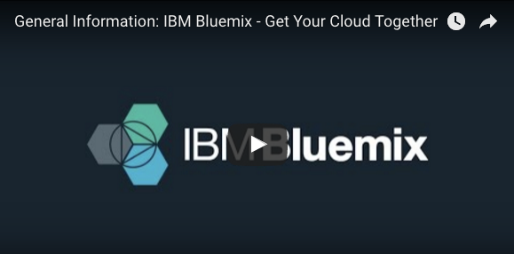

# Cursus de formation afin de développer des applications avec Bluemix

Formation Bluemix

## Prérequis pour débuter sur Bluemix

* An IBM Bluemix account. Either [sign up][bluemix_signup_url], or use an existing account.
* [Bluemix CLI](https://clis.ng.bluemix.net/ui/home.html)
* [OpenWhisk CLI](https://console.ng.bluemix.net/openwhisk/learn/cli)
* [Bluemix Container Registry plugin](https://console.ng.bluemix.net/docs/cli/plugins/registry/index.html)
* [Bluemix Container Service plugin](https://console.ng.bluemix.net/docs/containers/cs_cli_devtools.html)
* [Node.js](https://nodejs.org), version 6.9.1 (or later)
* [Kubernetes CLI (kubectl)](https://kubernetes.io/docs/tasks/kubectl/install/) version 1.5.3 (or later)
* [Docker CLI](https://docs.docker.com/engine/installation/) version 1.9 (or later)


# One micro-service, multiple deployment options

This project contains one simple micro-service that gets deployed:

* as a [Cloud Foundry](https://www.cloudfoundry.org/) application,
* as a container in a [Kubernetes cluster](https://kubernetes.io/),
* and as an [OpenWhisk](http://openwhisk.org/) action.

   <center>
      
   </center>

Watch this Youtube video that walks you through the deployment of the service and test the behavior of the deployment options when the service crashes:

   <center>
      <a href="https://youtu.be/Bdl9s2LxUZo"></a>
   </center>


## A propos de Bluemix


Selon [Wikipedia](https://fr.wikipedia.org/wiki/Bluemix):
IBM Bluemix est un outil de Cloud computing de type plate-forme en tant que service (PaaS) développé par IBM. Il permet d'utiliser plusieurs langages de programmation et services avec des outils de type DevOps. Bluemix est basé sur Cloud Foundry, ainsi que des technologies spécifiques à IBM, et tourne sur SoftLayer1,2. La plate-forme a coûté 1 milliard de dollars en 18 mois3. Elle a d'abord été en beta publique à partir de février 2014, puis disponible publiquement en juin4.


## Deploy the service in Bluemix with the toolchain

Follow [these instructions](./DEPLOY_TOOLCHAIN.md).


## Deploying the service manually in Bluemix

Follow [these instructions](./DEPLOY_MANUALLY.md).

## Service API

Once deployed, the service implements 3 API calls:
* compute the Fibonacci number after *n* iterations,
* let the computation run for *t* milliseconds,
* and simulate a crash of the service.

Depending on which compute option you are using, use the following cURL calls:

| Endpoint Type | Endpoint  | URL                                      |
| ------------- | --------- | ---------------------------------------- |
| Cloud Foundry | iteration | `curl -v http://fibonacci-service-<random-string>.mybluemix.net/fibonacci?iteration=1000` |
|               | duration  | `curl -v http://fibonacci-service-<random-string>.mybluemix.net/fibonacci?duration=5000` |
|               | crash     | `curl -v -X POST http://fibonacci-service-<random-string>.mybluemix.net/fibonacci?crash=true` |
| Kubernetes    | iteration | `curl -v http://<cluster-ip>:30080/fibonacci?iteration=1000` |
|               | duration  | `curl -v http://<cluster-ip>:30080/fibonacci?duration=5000` |
|               | crash     | `curl -v -X POST http://<cluster-ip>:30080/fibonacci?crash=true` |
| OpenWhisk     | iteration | `curl -v https://openwhisk.ng.bluemix.net/api/v1/web/<namespace>/default/fibonacci?iteration=1000` |
|               | duration  | `curl -v https://openwhisk.ng.bluemix.net/api/v1/web/<namespace>/default/fibonacci?duration=5000` |
|               | crash     | `curl -v -X POST https://openwhisk.ng.bluemix.net/api/v1/web/<namespace>/default/fibonacci?crash=true` |

## Code Structure

### Cloud Foundry application

| File                                     | Description                              |
| ---------------------------------------- | ---------------------------------------- |
| [app.js](service/app.js)                 | Main application, start the express web server and expose the service API |
| [lib/fibonacci.js](service/lib/fibonacci.js) | The implementation of the Fibonacci sequence, shared by all deployment options |
| [package.json](service/package.json)     | List the packages required by the application |
| [manifest.yml](service/manifest.yml)     | Description of the application to be deployed |
| [.cfignore](service/.cfignore)           | List files to ignore when deploying the application to Cloud Foundry |

### Kubernetes deployment

| File                                     | Description                              |
| ---------------------------------------- | ---------------------------------------- |
| [app.js](service/app.js)                 | Main application, start the express web server and expose the service API |
| [lib/fibonacci.js](service/lib/fibonacci.js) | The implementation of the Fibonacci sequence, shared by all deployment options |
| [package.json](service/package.json)     | List the packages required by the application |
| [Dockerfile](service/Dockerfile)         | Description of the Docker image          |
| [fibonacci-deployment.yml](service/fibonacci-deployment.yml) | Specification file for the deployment of the service in Kubernetes |

### OpenWhisk action

The OpenWhisk action is deployed as a [zip action](https://console.ng.bluemix.net/docs/openwhisk/openwhisk_actions.html#openwhisk_create_action_js) where several files are packaged into a zip file and the zip file is passed to OpenWhisk as the implementation for the action. **[deploy.js](service/deploy.js)** takes care of packaging the zip file.

| File                                     | Description                              |
| ---------------------------------------- | ---------------------------------------- |
| [handler.js](service/action/handler.js)  | Implementation of the OpenWhisk action   |
| [lib/fibonacci.js](service/lib/fibonacci.js) | The implementation of the Fibonacci sequence, shared by all deployment options |
| [package.json](service/action/package.json) | Specify the action entry point (handler.js) |
| [deploy.js](service/deploy.js)           | Helper to deploy and undeploy the OpenWhisk action |

### Tester web app

Under the `tester` directory is a simple web application to register and test the deployed micro-services. It can be pushed to Bluemix with `cf push` or simply executed locally with `python -m SimpleHTTPServer 28080` as example.

## Contribute

Please create a pull request with your desired changes.

## Troubleshooting

### Cloud Foundry

  Use
  ```
  cf logs fibonacci-service
  ```
  to look at the live logs for the web application.

### Kubernetes

  Use
  ```
  kubectl proxy
  ```
  and look at the status of the resources in the console.

### OpenWhisk

  Use
  ```
  wsk activation poll
  ```
  and perform an invocation of the action.

## License

See [License.txt](License.txt) for license information.

[bluemix_signup_url]: https://console.ng.bluemix.net/?cm_mmc=GitHubReadMe
