# Le catalogue de services Bluemix
<!-- page_number: true -->
<!-- $size: 16:9 -->
<!-- prerender: true -->
<!-- footer: OPEN GROUPE - Formation Bluemix - JUIN 2017 -->
Le catalogue de service Bluemix dispose de plus de 140 services et APIs.
<center>
      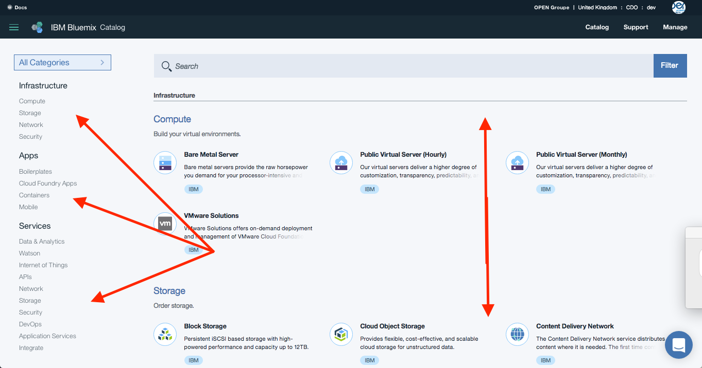
</center>

Chaque catégorie est listée dans le menu de gauche avec 3 grands thèmes:
* Infrastructure (Compute, Storage, Network & Security)
* Apps
* Services

---

* Infrastructure.

```
Compute – Les serveurs physiques (Bare Metal) et machines virtuelles (Virtual Servers) sont consommables au mois
ou à l'heure afin de concevoir finement votre architecture. VMware est également disponible à l'achat.
```
<center>
      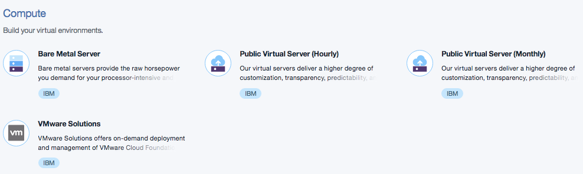
</center>

---

```
Storage – Choississer le type de stockage que vous avez besoin.
Bluemix dispose de plusieurs options comme file storage,
block storage et object storage,
configurable afin de choisir vitesse et performance.
```
<center>
      
</center>

---
```
Networking – Partie critique de la partie Infrastructure.
Plusieurs choix possible ici également avec Direct Link
et  réseaux privés VPN, Load Balancing, VLAN spanning et Vyatta gateways
pour des connexions sécurisées.
```
<center>
      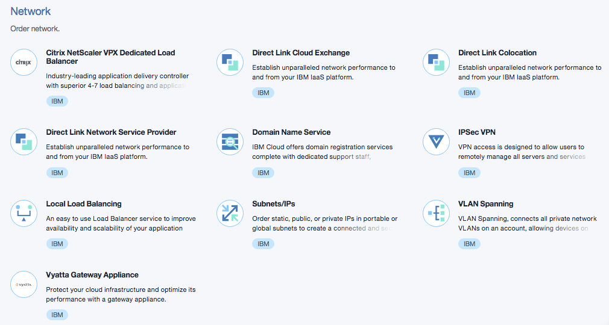
</center>

---
```
Security – Assurer la meilleur protection de votre application.
Bluemix offre une variété de pare-feux physiques et de certificats SSL
pour garantir la sécurité de vos applications.
```
<center>
      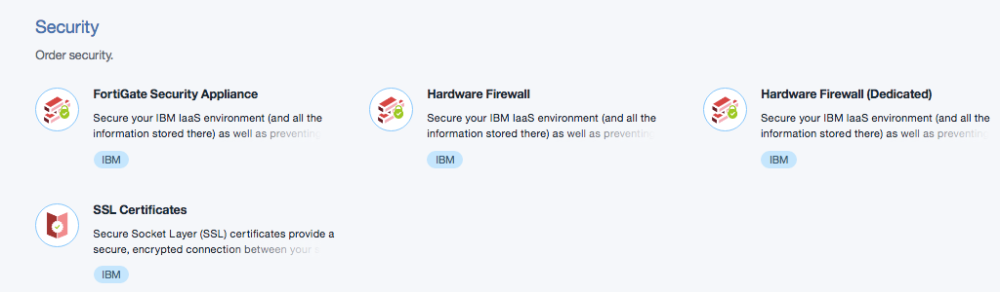
</center>

---
* Apps (Applications).
```
Boilerplates – Ce sont des kits de démarrage prêts à l'emploi
démontrant ainsi la puissance de Bluemix.
Les Boilerplates sont déployables en quelques secondes
avec le code source réutilisable et modifiable.
```
<center>
      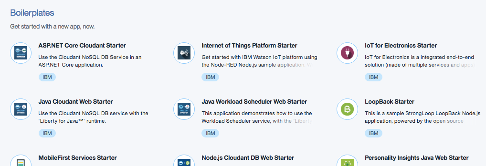
</center>

---
```
Cloud Foundry Apps – Une ressource pour les développeurs désirant
une expérience de développement sur l'étagère (out-of-the-box).
Plus besoin de gérer les dépendances et les library. Seul le code est important
```
<center>
      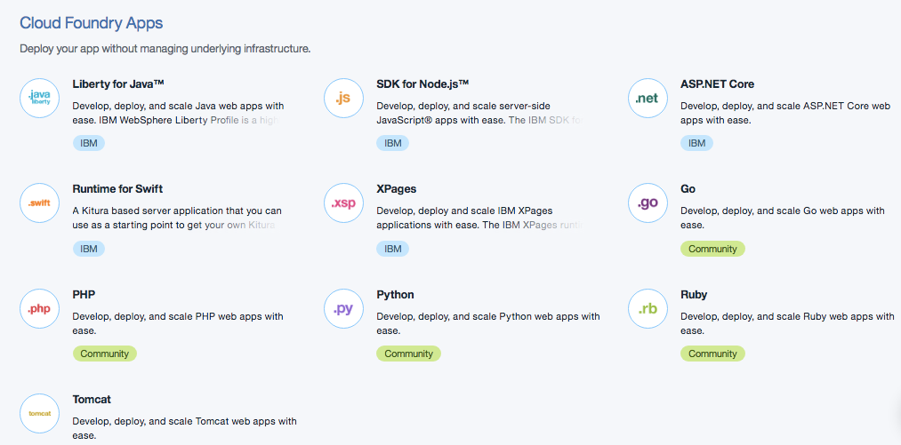
</center>

---
```
Containers – Un environneement isolé et sécurisé pour vos applications
qui supporte plusieurs langages et charge de travail
sans avoir besoin d'outils de programmation.
Cela fait que la technologie des containers extrement portable .
Cette technologie est basée sur Docker.
```
<center>
      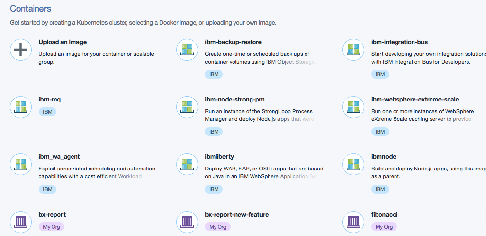
</center>

---
```
OpenWhisk – Une technologie sans serveur pour éxécuter son code sur événement.
Par exemple, vous ne voulez utiliser un programme que lorsque vous recevez
une alerte.

Vous ne payez que pour le temps d'éxécution (en ms)
```
<center>
      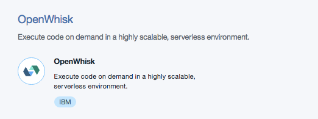
</center>

---
```
Mobile – Des services autour du développement d'applications mobiles.
```
<center>
      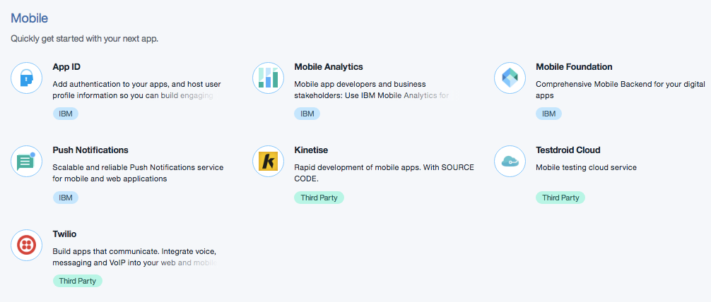
</center>

---

Passons maintenant à la section Services du catalogue.
Il est possible de consulter le catalogue en entier ou bien de choisir les familles de services avec le menu de gauche.
<center>
      
</center>

---

```
Data & Analytics – Un ensemble de services et d'APIs
pour stocker et analyzer vos données.

```
<center>
      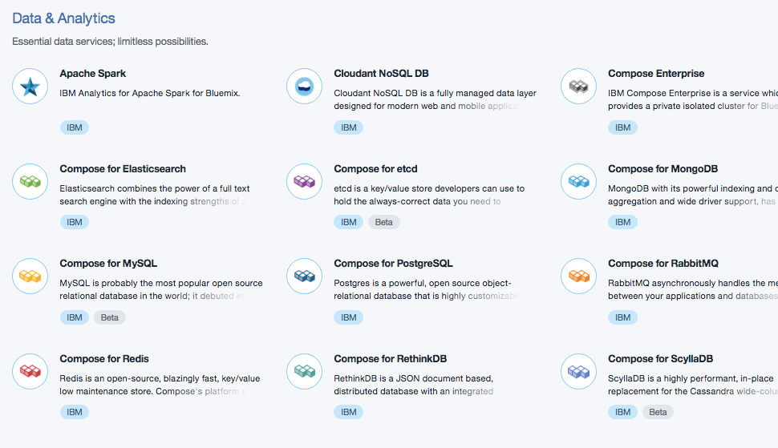
</center>

---
```
Watson – IBM délivre les capacités cognitives via Watson.
Vous pouvez enrichir vos applications avec des services
de machine learning et de reconnaissance d'images.
Watson permet d'analyser des données non structurées, traduire des documents
ou encore d'analyser votre personnalité.
```
<center>
      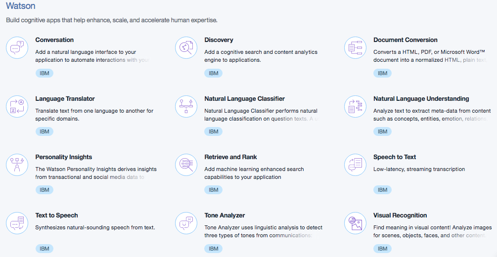
</center>

---
```
Internet of Things – Tout objet connecté à un réseau peut etre de l'IoT,
tout comme votre téléphone portable.
Bluemix dispose d'une plate-forme IoT complète.
Une fois votre objet connecté, tirez parti des services IoT
pour analyser toutes ces données.
```
<center>
      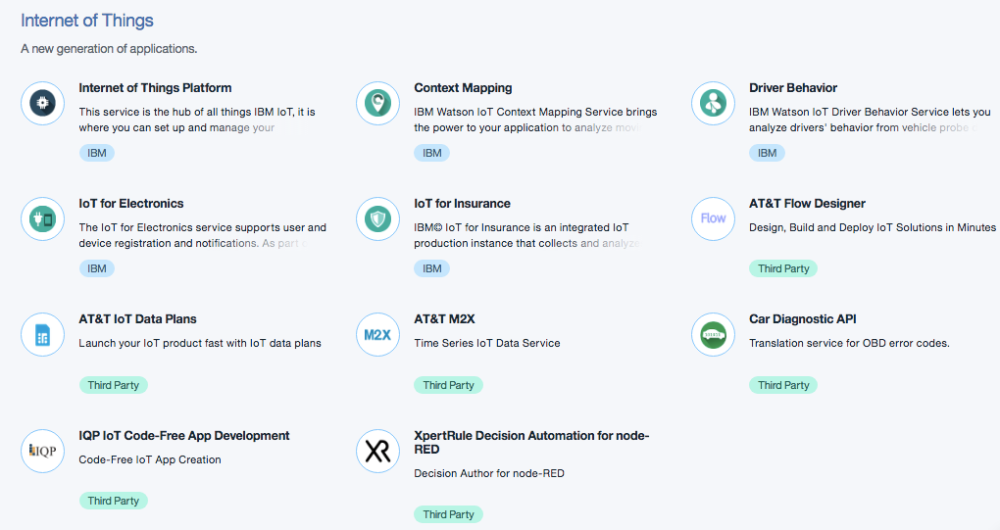
</center>

---
```
APIs – Ce service est indispensable pour gérer le cycle
de vie de vos APIs.
```
<center>
      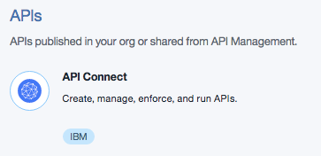
</center>

---

```
Network – En plus des services Réseaux dans la partie infrastructure,
un VPN est disponible pour les containers.

```
<center>
      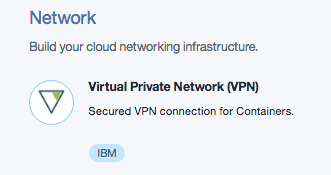
</center>

---

```
Security – Le service Sécurité permet de renforcer la sécurité des applications
(scan des failles de sécurité d'applications Web ou mobile
ou SSO pour implémenter de l'authentification)
Même si Bluemix est sécurisé de part son architecture,
il se doit de considérer plus de sécurité à chaque application.
```
<center>
      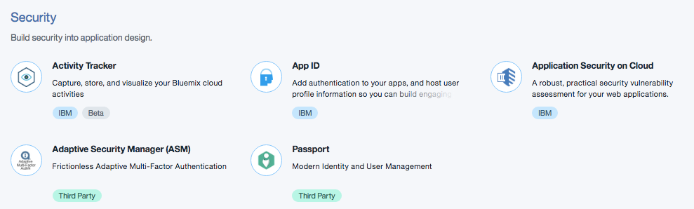
</center>

---
```

DevOps – Adoptez une approche DevOps en utilisant les services
de gestion du cycle de vie d'applications.
Cela inclut une chaîne d'outils ouverte automatisant
la génération et le déploiement d'applications.
Vous pouvez commencer en créant une chaîne d'outils de déploiement simple
qui prend en charge les tâches de développement,
de déploiement et les opérations.

```
<center>
      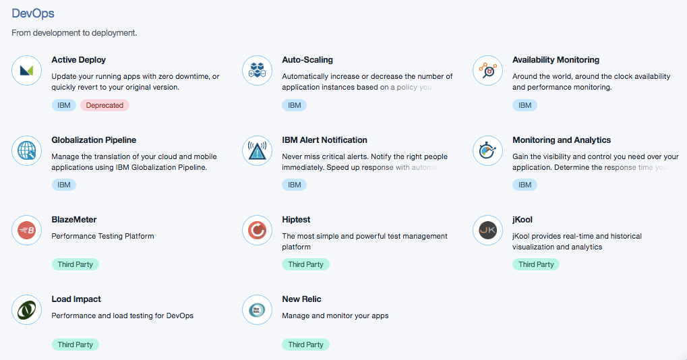
</center>

---

```
Application Services – Un large choix de services pour
donner de la valeur à votre application web ou mobile.
Ces services laissent aux développeurs plus de temps
pour coder leur applications et du temps pour l'innovation.
```
<center>
      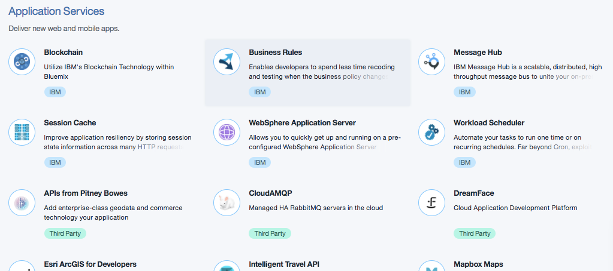
</center>

---
```
Integrate – Des services pour créer un cloud hybride.
```
<center>
      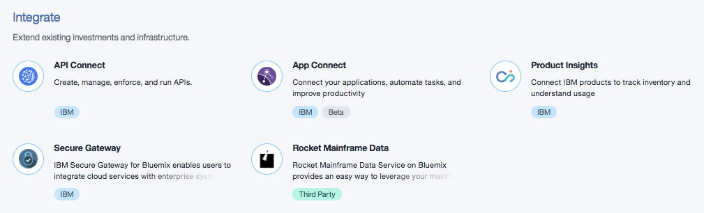
</center>

---

```
A la fin du catalogue, vous noterez une section
pour des services  Bluemix experimentaux.
Ce sont les services qui sont en cours de développement
par les LABs IBM, qui potentiellement seront intégrés au catalogue général.

```
<center>
      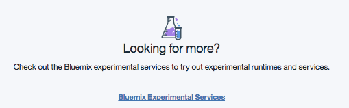
</center>


---

Suivre le chapitre suivant [Déployer une application](deploy/README.md).
---

## Enjoy Bluemix ! :+1:
