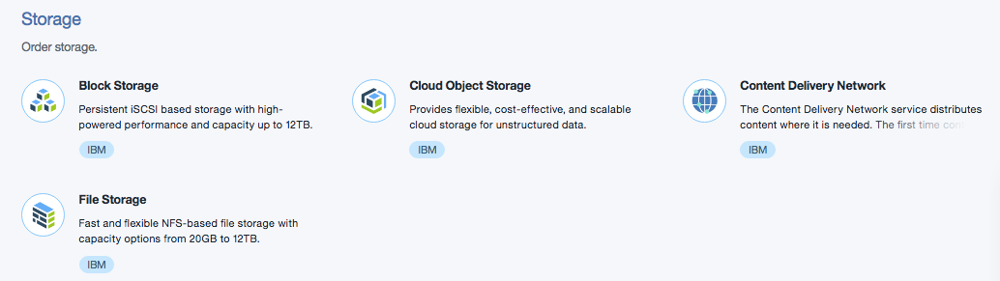

# Le catalogue de services Bluemix

<!-- page_number: true -->
<!-- $size: 16:9 -->
<!-- prerender: true -->
<!-- footer: OPEN GROUPE - Formation Bluemix - JUIN 2017 -->

Le catalogue de service Bluemix dispose de plus de 140 services et APIs.

<center>
      
</center>

Chaque catégorie est listée dans le menu de gauche avec 3 grands thèmes:
>* Infrastructure (Compute, Storage, Network & Security)
* Apps
* Services.

---

* Infrastructure.

```
Compute – Les serveurs physiques (Bare Metal) et machines virtuelles (Virtual Servers) sont consommables au mois
ou à l'heure afin de concevoir finement votre architecture. VMware est également disponible à l'achat.
```
<center>
      
</center>


```
Storage – Choississer le type de stockage que vous avez besoin.
Bluemix dispose de plusieurs options comme file storage,
block storage et object storage, configurable afin de choisir vitesse et performance.
```
<center>
      
</center>

```
Networking – Partie critique de la partie Infrastructure.
Plusieurs choix possible ici également avec Direct Link et  réseaux privés VPN, Load Balancing, VLAN spanning et Vyatta gateways pour des connexions sécurisées.
```
<center>
      
</center>

```
Security – Assurer la meilleur protection de votre application.
Bluemix offre une variété de pare-feux physiques et de certificats SSL pour garantir la sécurité de vos applications.
```
<center>
      
</center>

---
* Apps (Applications).
```
Boilerplates – Ce sont des kits de démarrage prêts à l'emploi démontrant ainsi la puissance de Bluemix.
Les Boilerplates sont déployables en quelques secondes avec le code source réutilisable et modifiable.
```
<center>
      
</center>

```
Cloud Foundry Apps – Une ressource pour les développeurs désirant une expérience de développement sur l'étagère (out-of-the-box).
Plus besoin de gérer les dépendances et les library.
Seul le code est important
```
<center>
      
</center>

---
```
Containers – Isolated and secure app environments (or a
compute resource) which can support languages and
workloads without requiring any programming tools. This
makes Containers technology super portable and gives you
control without the worry of handling the operating system.
This technology is based on Docker.
```
<center>
      
</center>

---
```
OpenWhisk – A serverless technology that is great for
executing code in a highly scalable way. For example, you may
only need a compute resource for when you receive an alert.
OpenWhisk can fire up code only for the period it takes to react
to the alert, and then shut down. You only pay for when the
code is running.
```
<center>
      
</center>

---
```
Mobile – Where those ideas can come from the back of your
brain stem to the front of your user’s mobile device. With a rich
set of capabilities for mobile development, this section offers a
complete mobile app building platform.
```
<center>
      
</center>

---

Passons maintenant à la section Services du catalogue.
Il est possible de consulter le catalogue en entier ou bien de choisir les familles de services avec le menu de gauche.
<center>
      
</center>
---
```
Data & Analytics – a set of services and APIs to help you store
and analyze data. As we are creating data all of the time, that
data needs a place to be stored using services like Cloudant or
the Compose offerings. There are services to analyse the data
too. You can also see the fruits of a strategic partnership
between IBM and Twitter, unlocking the data to one of the
world’s biggest social platforms.
```
<center>
      
</center>
---
```
Watson – IBM delivers cognitive capabilities through Watson.
Here is where you can enrich your application with services like
machine learning and visual recognition. The array of Watson
services spans capabilities like analyzing unstructured data like
text and images, to gaining a deeper understanding of a
person’s personality traits.
```
<center>
      
</center>
---
```
Internet of Things – Any device that can connect to a network
can be IoT, just like your mobile phone. Bluemix offers a
complete IoT Platform, which is a set of capabilities to quickly
get any device connected to the IBM Cloud. You can stream
and analyze that data in real time with IoT services.
```
<center>
      
</center>

```
APIs – Whether you are leveraging map or traffic data from
Google maps, or using a Facebook profile to identify a user, you
can create new APIs to consume, monetize, or manage existing
APIs with API Connect. This service is a great way to manage
the lifecycle of an API.
```
<center>
      
</center>

---

In the API category, we are going to pause to see that all Bluemix services
and APIs within the Bluemix catalog are laid out in the same way.
1. Click and open the API Connect service (Fig 4.2).
2. On the top left, you will see a summary of the service
(Fig 4.2)

Note:
The pricing section is laid out in a very simple way. For Bluemix
Public, pricing is always based on tiers. Services have different tiers
depending on how they are measured, like # API calls, or #
Gigabytes or Terabytes used, or # Instances. The majority of our
services will have a free tier, just like API Connect, so you can test
drive the service and ensure that it is a fit for your need.
3. Towards the center of the page, you will see the key benefits and
features of the service you have opened.
(Fig 4.3)
4. Next up are screen shots of the service in action, videos or even slides.
You can open these to see them in a larger view (Fig 4.2).
5. Finally, in every service or API, you will find easy to follow pricing
information (Fig 4.3).
6. Now click ‘View All’ on the very top of this page to continue with the
rest of the Bluemix services.
---


```
Network – you have already seen this in the Infrastructure
section.
```
<center>
      
</center>

---

```
Security – The Security service offerings have been designed
especially to provide added security for an application, with
services like Application Security on Cloud that scans your web
or mobile application for vulnerabilities, or Single Sign-On for
implementing user authentication.
Going back to the catalog will bring you to the top section, so scroll down
to Network and let’s continue to explain what we see.
Bluemix is very secure, but every application
should consider additional Security
```
<center>
      
</center>

---
```

DevOps – Development Operations describes the lifecycle of an
application, from inception to production to upgrades to
eventual retirement. The range of DevOps services within
Bluemix helps you respond to markets changes faster, improve
code quality, scale without disruption, and foster a new world
where business, IT and Operations come together.
Third Party
IBM doesn’t just provide IBM services on Bluemix. We also
host a range of services from third party providers, like Load
Impact or New Relic. You will see here that IBM services have
an IBM tag, in blue, while Third Party services carry a green tag
```
<center>
      
</center>

---

```
Application Services – provides a huge range of services to
complement a web or mobile application. These services help
developers spend less time coding and more time innovating.
Integrate – A rich set of integration services to create a truly
hybrid experience, with services that help you leverage your
existing on-premises investments. Bluemix has services like
Secure Gateway for connecting another source to Bluemix, and
a third party service like Rocket Mainframe Data to easily
leverage existing mainframe data.
```
<center>
      
</center>

---

```
A la fin du catalogue, vous noterez une section pour des services  Bluemix experimentaux.
Experimental Services
Located at the bottom of the catalog is a link to the Bluemix
experimental services. These are services that IBM is assessing
to understand the value they might provide to our users.
Experimental services are also a great way to see what
potential technologies could arrive next on Bluemix.
Experimental services are never for production use (Fig 4.4).

```
<center>
      
</center>


---

## Enjoy Bluemix ! :+1:
