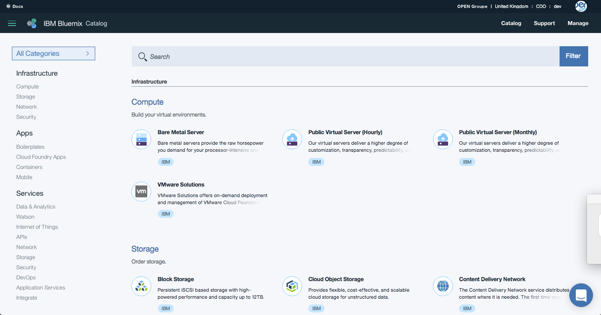

# Le catalogue de services Bluemix

      

The Catalog menu tab in Bluemix is probably where you will spend most of
your time exploring. There are over 130 services and APIs so it could take
you a few hours to study each of them in detail. Maybe not everyone will
be interested in Databases or in Internet of Things, so in this guide, we will
we avoid going into too much detail when walking through the catalog.
For the demo, you are just going to talk about what you see. Each of the
categories are listed along the left side menu, with Infrastructure
(Compute, Storage, Network & Security), Apps and Services. In your demo,
keep each category high level and only talk about the services you know
the listener is interested in.
Don’t forget that there is a YouTube video which points to a ‘typical demo’
or walkthrough of the Bluemix catalog.

Compute – Bare Metal and Virtual Servers are offered in hourly
and monthly pricing formats to fully customize your IT stack to
meet your specific needs. VMware is also available for
ordering.
Here are the first set of category outlines with talking points for each
section. Halfway through the catalog, you can open one of the services to
show how all Bluemix services are laid out.
First, start with Infrastructure, diving into Compute as you explore around,
just like in Fig 4.1. Note how bare metal is offered in both monthly and
hourly pricing…just like virtual servers.
Infrastructure:
Storage – Choose and order the type of storage you need.
Bluemix has a range of storage options, like file storage, block
storage and object storage, that can be customized by speed
and performance.
Let’s explore some highlights of each category.
(Fig 4.1)
IBM
The Bluemix Catalog
Page 16 2017
Networking – A critical part of Infrastructure, so choices here
again are plentiful, with Direct Link and VPN private
connections, Load Balancing to improve availability and
scalability, and VLAN spanning and Vyatta gateways for secure
connections.
Security– Ensure greater protection of your application.
Bluemix offers a variety of hardware firewalls and SSL certs to
help further lock down your app.
Next, we move to the Apps (or Applications) section of the catalog.
Boilerplates – These are ready-made templates to show the
power of Bluemix to get started quickly. The boilerplates are
everything you need to get an application up and running in
seconds, including sample code.
Cloud Foundry Apps – A compute resource for developers who
want an out-of-the-box development experience. This means
they don’t need to worry about libraries, dependencies, and all
of the usual boring stuff a developer needs to deal with before
they can start to code. With Cloud Foundry, everything is ready
for you to start coding.
Containers – Isolated and secure app environments (or a
compute resource) which can support languages and
workloads without requiring any programming tools. This
makes Containers technology super portable and gives you
control without the worry of handling the operating system.
This technology is based on Docker.
IBM
The Bluemix Catalog
Page 17 2017
OpenWhisk – A serverless technology that is great for
executing code in a highly scalable way. For example, you may
only need a compute resource for when you receive an alert.
OpenWhisk can fire up code only for the period it takes to react
to the alert, and then shut down. You only pay for when the
code is running.
Mobile – Where those ideas can come from the back of your
brain stem to the front of your user’s mobile device. With a rich
set of capabilities for mobile development, this section offers a
complete mobile app building platform.
As we continue through the catalog, next we move into the Services
section of the catalog.
You can always jump or skip sections in the catalog by using
the navigation on the left menu bar.
Tip:
Data & Analytics – a set of services and APIs to help you store
and analyze data. As we are creating data all of the time, that
data needs a place to be stored using services like Cloudant or
the Compose offerings. There are services to analyse the data
too. You can also see the fruits of a strategic partnership
between IBM and Twitter, unlocking the data to one of the
world’s biggest social platforms.
Watson – IBM delivers cognitive capabilities through Watson.
Here is where you can enrich your application with services like
machine learning and visual recognition. The array of Watson
services spans capabilities like analyzing unstructured data like
text and images, to gaining a deeper understanding of a
person’s personality traits.
IBM
The Bluemix Catalog
Page 18 2017
Internet of Things – Any device that can connect to a network
can be IoT, just like your mobile phone. Bluemix offers a
complete IoT Platform, which is a set of capabilities to quickly
get any device connected to the IBM Cloud. You can stream
and analyze that data in real time with IoT services.
APIs – Whether you are leveraging map or traffic data from
Google maps, or using a Facebook profile to identify a user, you
can create new APIs to consume, monetize, or manage existing
APIs with API Connect. This service is a great way to manage
the lifecycle of an API.
In the API category, we are going to pause to see that all Bluemix services
and APIs within the Bluemix catalog are laid out in the same way.
1. Click and open the API Connect service (Fig 4.2).
2. On the top left, you will see a summary of the service
(Fig 4.2)
IBM
The Bluemix Catalog
Page 19 2017
Note:
The pricing section is laid out in a very simple way. For Bluemix
Public, pricing is always based on tiers. Services have different tiers
depending on how they are measured, like # API calls, or #
Gigabytes or Terabytes used, or # Instances. The majority of our
services will have a free tier, just like API Connect, so you can test
drive the service and ensure that it is a fit for your need.
3. Towards the center of the page, you will see the key benefits and
features of the service you have opened.
(Fig 4.3)
4. Next up are screen shots of the service in action, videos or even slides.
You can open these to see them in a larger view (Fig 4.2).
5. Finally, in every service or API, you will find easy to follow pricing
information (Fig 4.3).
6. Now click ‘View All’ on the very top of this page to continue with the
rest of the Bluemix services.
IBM
The Bluemix Catalog
Page 20 2017
Network – you have already seen this in the Infrastructure
section.
Security – The Security service offerings have been designed
especially to provide added security for an application, with
services like Application Security on Cloud that scans your web
or mobile application for vulnerabilities, or Single Sign-On for
implementing user authentication.
Going back to the catalog will bring you to the top section, so scroll down
to Network and let’s continue to explain what we see.
Bluemix is very secure, but every application
should consider additional Security
Tip:
DevOps – Development Operations describes the lifecycle of an
application, from inception to production to upgrades to
eventual retirement. The range of DevOps services within
Bluemix helps you respond to markets changes faster, improve
code quality, scale without disruption, and foster a new world
where business, IT and Operations come together.
Third Party
IBM doesn’t just provide IBM services on Bluemix. We also
host a range of services from third party providers, like Load
Impact or New Relic. You will see here that IBM services have
an IBM tag, in blue, while Third Party services carry a green tag
IBM
The Bluemix Catalog
Page 21 2017
Application Services – provides a huge range of services to
complement a web or mobile application. These services help
developers spend less time coding and more time innovating.
Integrate – A rich set of integration services to create a truly
hybrid experience, with services that help you leverage your
existing on-premises investments. Bluemix has services like
Secure Gateway for connecting another source to Bluemix, and
a third party service like Rocket Mainframe Data to easily
leverage existing mainframe data.
At the end of the catalog, you will notice a section for Bluemix
experimental services.
Experimental Services
Located at the bottom of the catalog is a link to the Bluemix
experimental services. These are services that IBM is assessing
to understand the value they might provide to our users.
Experimental services are also a great way to see what
potential technologies could arrive next on Bluemix.
Experimental services are never for production use (Fig 4.4).
(Fig 4.4)
IBM
