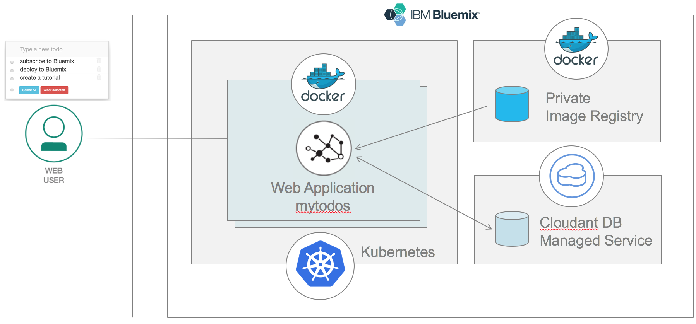
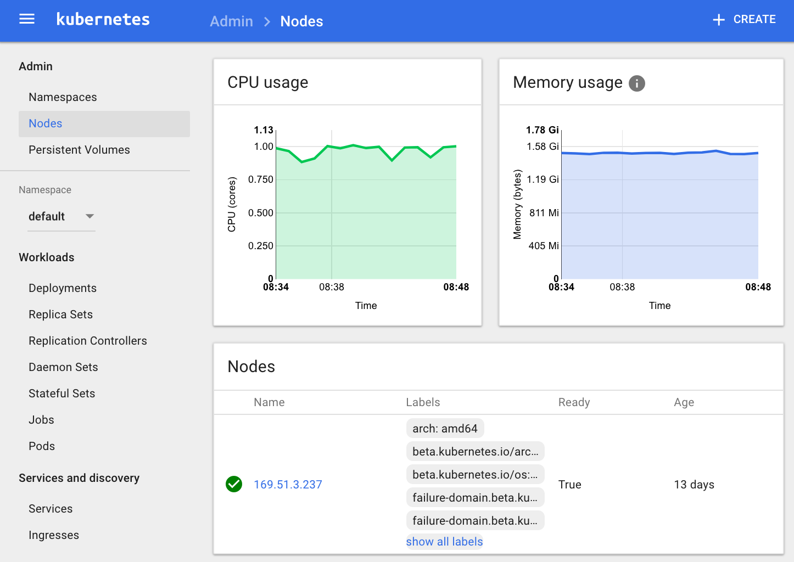

# Les containers avec Bluemix

<!-- page_number: true -->
<!-- $size: 16:9 -->
<!-- prerender: true -->
<!-- footer: OPEN GROUPE - Formation Bluemix - JUIN 2017 -->


Vous allez découvrir les concepts liés à kubernetes, son architecture, ses fonctionalités, ces concepts de développement en relation avec le service IBM Container.
Au travers de cet exercice, vous utiliserez la ligne de commande (CLI) pour créer un cluster, le gérer et y associer un service Bluemix.


# Prérequis
+ Avoir un [id IBM Bluemix](https://bluemix.net)
+ Installer le [Bluemix CLI](http://clis.ng.bluemix.net)
+ Installer docker pour [Mac](https://docs.docker.com/engine/installation/mac/) ou [Windows](https://docs.docker.com/engine/installation/windows/)
+ Installer [Kubectl](https://kubernetes.io/docs/user-guide/prereqs/)
+ Installer un [client Git](https://git-scm.com/downloads)
+ Installer [Node.js](https://nodejs.org)


# Etapes

1. [Installer les plugins Bluemix Container Service et Container Registry](#etape-1---installer-les-plugins-bluemix-container-service-et-registry)
1. [Se Connecter à Bluemix](#etape-2---se-connecter-à-bluemix)
1. [Créer un  cluster](#etape-3---créer-un--cluster)
1. [Avoir et concevoir le code de l'application](#step-4---avoir-et-concevoir-le-code-de-lapplication)
1. [Concevoir et pousser le containeur de l'application](#etape-5---Concevoir-et-pousser-le-containeur-de-lapplication)
1. [Associer un service Bluemix au cluster Kubernetes](#etape-6---Associer-un-service-Bluemix-au-cluster-Kubernetes)
1. [Créer les Services et Deployments Kubernetes](#etape-7---Créer-les-Services-et-Deployments-Kubernetes)
1. [Surveiller vos containeurs avec Weave Scope](#etape-8---Surveiller-vos-containeurs-avec-Weave-Scope)
1. [Passer à l'échelle et nettoyer vos services](#etape-9---Passer-à-léchelle-et-nettoyer-vos-services)


## Etape 1 - Installer les plugins Bluemix Container Service et Registry

Pour créer des clusters  Kubernetes, et gérer les worker nodes, il faut installer le plug-in Container Service.

1. Ouvrir un terminal ligne de commande.

1. Avant d'installer le plugin container, il faut ajouter le dépot Bluemix CLI.

    ```
    bx plugin repos
    ```
    Output:
    ```
    Listing added plug-in repositories...

    Repo Name   URL
    Bluemix     https://plugins.ng.bluemix.net
    ```

1. Si vous ne voyez aucun dépot Bluemix, lancez la commande suivante:
    ```
    bx plugin repo-add Bluemix https://plugins.ng.bluemix.net
    ```

1. Pour installer le plugin Container Service , lancez la commande suivante:

    ```
    bx plugin install container-service -r Bluemix
    ```

1. Pour gérér un registre d'images privées, installez le plug-in Registry. Ce plug-in permet d'accéder au dépot d'images privées Bluemix, où vous pourrez stocker vos images docker qui seront utilisées pour construire vos containeurs. Le préfixe pour lancer la commande au registre est **bx cr**.

    ```
    bx plugin install container-registry -r Bluemix
    ```

1. Pour vérifier que le plug-in est correctement installé, lancez la commande suivante:

    ```
    bx plugin list
    ```
    et deux plug-ins doivent s'afficher:
    ```
    Listing installed plug-ins...

    Plugin Name          Version
    container-registry   0.1.104
    container-service    0.1.219
    ```

## Etape 2 - Se Connecter à Bluemix

1. Se connecter à Bluemix

    ```
    bx login -a https://api.ng.bluemix.net
    ```

1. Se connecter au plug-in IBM Bluemix Container Service Kubernetes .
Le préfixe pour se connecter à ce plug-in est is **bx cs**.
    ```
    bx cs init
    ```

## Etape 3 - Créer un  cluster

Pour créer un cluster, vous avez deux options entre un cluster gratuit ou un cluster payant.

+ Un cluster gratuit **free cluster** ne contient qu'un seul worker node pour déployer des containeurs.
Le worker node est la machine hôte, typiquement une machine virtuelle, qui héberge vos applications.
Aller à l'étape 3.1 *Créer votre cluster Kubernetes gratuit*

+ Un cluster payant **paid cluster** peut avoir autant de worker nodes que vous voulez.
 Un cluter payant nécessite d'avoir un compte Bluemix Infrastructure (SoftLayer).
 Aller à l'étape 3.2 *définir ses accès SoftLayer*.

1. Créer votre cluster Kubernetes gratuit.
    ```
    bx cs cluster-create --name <your-cluster-name>
    ```
    Une fois que le cluster affiche le message **deployed** vous pouvez provisioner des pods, but they will be enqueued until the cluster’s pods are finished provisioning. Note that it takes up to 15 minutes for the worker node machine to be ordered and for the cluster to be set up and provisioned.
    Notez qu'il faut au moins 15 minutes pour la machine worker node et que le cluster soient configurés et provisionés.

    Si vous avez créé un cluster gratuit dans l'étape précédente, passez à l'étape 3.7 **Vérifier que la création du cluster soit effective.**.

1. Définir les credentials SoftLayer
    ```
    bx cs credentials-set --softlayer-username <YOUR-USER-NAME> --softlayer-api-key <YOUR-API-KEY>
    ```

1. Voir les data centers qui sont disponibles.
    ```
    bx cs locations
    ```
    et vous devriez avoir une liste similaire si vous êtes connecté en Allemagne
    ```
    ams03
    fra02
    ```

1. Voir les types de machines disponibles dans le data center.
    ```
    bx cs machine-types <datacenter>
    ```
    et vous devriez avoir une liste similaire:
    ```
    bx cs machine-types dal10
    Getting machine types list...
    OK
    Machine Types
    Name         Cores   Memory   Network Speed   OS             Storage   Server Type   
    u1c.2x4      2       4GB      100Mbps         UBUNTU_16_64   100GB     virtual
    b1c.4x16     4       16GB     1000Mbps        UBUNTU_16_64   100GB     virtual
    b1c.16x64    16      64GB     1000Mbps        UBUNTU_16_64   100GB     virtual
    b1c.32x128   32      128GB    1000Mbps        UBUNTU_16_64   100GB     virtual
    b1c.56x242   56      242GB    1000Mbps        UBUNTU_16_64   100GB     virtual
    ```

1. Voir les VLANs disponibles avec votre compte.
    ```
    bx cs vlans <datacenter>
    ```
    et vous devriez avoir une liste similaire:
    ```
    Getting VLAN list...
    OK
    ID        Name   Number   Type      Router
    1556821          1860     private   bcr01a.dal10
    1556815          1626     public    fcr01a.dal10
    ```
    Note: Quand vous créez un cluster Kubernetes sans vlans, ils sont créés pour vous.

1. Créer un cluster
    ```
    bx cs cluster-create --name <YOUR-CLUSTER-NAME> --location dal10 --workers 3 --machine-type u1c.2x4 --hardware shared --public-vlan <ID-PRIVATE-VLAN> --private-vlan <ID-PUBLIC-VLAN>
    ```

1. Valider la demande de création du cluster.
    ```
    bx cs clusters
    ```

1. Vérifier l'état des worker nodes.
    ```
    bx cs workers <cluster_name_or_id>
    ```

1. Vous aurez besoin des données et certificats pour se connecter à votre cluster avec l'outil kubectl.
Vous pouvez télécharger la configuration sur votre ordinateur avec la ligne de commande CLI.
Lancer la commande suivante pour un cluster donné.
    ```
    bx cs cluster-config <cluster_name_or_id>
    ```

1. Utilisez le résultat de cette commande pour enregistrer la configuration Kubernetes comme variable d'environnement.
    Pour Mac: ```export KUBECONFIG=/Users/ibm/.bluemix/plugins...```
    Pour Windows: ```set KUBECONFIG=/Users/ibm/.bluemix/plugins...```

1. Accéder à votre tableau de bord Kubernetes avec le port par défaut 8001.
    ```
    kubectl proxy
    Starting to serve on 127.0.0.1:8001
    ```

1. Ouvrir le tableau de bord Kubernetes: [http://localhost:8001/ui](http://localhost:8001/ui)


   


## Etape 4 - Avoir et concevoir le code de l'application

1. Cloner ou télécharger le code source de l'application Todo.
    ```
    git clone https://github.com/lionelmace/mytodo
    ```
    Cette commande créée un dossier du projet sur votre disque local.

1. Se déplacer dans le répertoire du projet.
    ```
    cd mytodo
    ```

1. Installler les dépendances node.js pour ce projet.
    ```
    npm install
    ```

## Etape 5 - Concevoir et pousser le containeur de l'application

1. Se connecter au registre Privé des containeurs Bluemix. Utile si vous n'avez pas fait `bx login` précédemment.
    ```
    bx cr login
    ```
    `bx cr login` est utilisé pour connecter votre démon docker local au registre, qui vous permettra de pousser ou récupérer des images.

1. Créer le namespace pour votre registre.
    ```
    bx cr namespace-add <YOUR-NAMESPACE-NAME>
    ```

1. Si vous avez perdu votre namespace, éxéxuter la commande suivante.
    ```
    bx cr namespace-list
    ```

1. Construire l'image docker qui inclut les fichiers de l'application.

    ```
    docker build -t registry.ng.bluemix.net/<namespace>/mytodos:v1 .
    ```

    Note: Si vous avez déjà une image, il n'y a juste qu'à lui donner un tag avant de la pousser.
    ```
    docker tag mytodos:v1 registry.ng.bluemix.net/<namespace>/mytodos:v1
    ```

1. Pousser l'image vers votre registre privé.
    ```
    docker push registry.ng.bluemix.net/<namespace>/mytodos:v1
    ```

1. Vérifier que l'image a été ajouté avec succès dans votre registre.
    ```
    bx cr images
    ```
    Output:
    ```
    Listing images...

    REPOSITORY                                  NAMESPACE   TAG       DIGEST         CREATED        SIZE     VULNERABILITY STATUS
    registry.ng.bluemix.net/your-namespace/mytodos   namespace   1   0d90cb732881   1 minute ago   264 MB   OK
    ```


## Etape 6 - Associer un service Bluemix au cluster Kubernetes

Cette application web utilise une base de données Cloudant pour stocker vos todo.

1. Lister tous les services disponibles dans le catalogue.
    ```
    bx service offerings
    ```

1. Créer une instance du service.
    ```
    bx service create <service_name> <service_plan> <service_instance_name>
    ```
    Exemple: ```bx service create cloudantNoSQLDB Lite mycloudantinstance```

1. Vérifier que le service est bien créé.
    ```
    bx service list
    ```

1. Vérifier votre namespace Kubernetes qui sera nécessaire par la suite.
    ```
    kubectl get namespaces
    ```
    Output:
    ```
    NAME          STATUS    AGE
    default       Active    7d
    ibm-system    Active    7d
    kube-system   Active    7d
    ```

1. Associer votre service au cluster Kubernetes.
    ```
    bx cs cluster-service-bind <cluster_id> <kube_namespace> <service_instance_name>
    ```
    Example:
    ```
    bx cs cluster-service-bind ad35aacc139b4e11a6f3182fb13d24af default todo-cloudant
    ```
    Note: Utiliser le namepsace **default** ou créer le votre.

1. Controller que vos secret ont été créé correctement.
    ```
    kubectl get secrets
    ```


## Etape 7 - Créer les Services et Deployments Kubernetes

1. Editer le fichier YAML `deploy2kubernetes.yml` afin de définir le namespace de votre registre privé. Si vous avez oublié votre namespace, lancer la commande suivante:
    ```
    bx cr namespace-list
    ```

    Votre fichier YAML ressemble à ça:
    ```
    yml
    ---
    # Service to expose frontend
    apiVersion: v1
    kind: Service
    metadata:
      name: mytodos
      labels:
        app: mytodos
        tier: frontend
    spec:
      # if your cluster supports it, uncomment the following to automatically create
      # an external load-balanced IP for the frontend service.
      # type: LoadBalancer
      type: NodePort
      ports:
      - port: 8080
        nodePort: 31513
      selector:
        app: mytodos
        tier: frontend
    ---
    # Application to deploy
    apiVersion: extensions/v1beta1
    kind: Deployment
    metadata:
      name: mytodos
    spec:
      replicas: 2 # tells deployment to run 2 pods matching the template
      template: # create pods using pod definition in this template
        metadata:
          labels:
            app: mytodos
            tier: frontend
        spec:
          containers:
          - name: mytodos
            image: registry.ng.bluemix.net/<your-namespace>/mytodos:v1
            imagePullPolicy: Always
            resources:
              requests:
                cpu: 100m
                memory: 100Mi
            volumeMounts:
              - mountPath: /opt/service-bind # Mount the "service-bind-volume" volume into the pod.
                name: service-bind-volume
          volumes:
            - name: service-bind-volume
              secret:
                defaultMode: 420
                secretName: binding-todo-cloudant
    ```
    Note: Le nom du  secretName est  la concatenation de **binding-** et du nom du service.

1. Deployez l'application vers un pod de votre cluster Kubernetes.
    ```
    kubectl create -f deploy2kubernetes.yml

    service "mytodos" created
    deployment "mytodos" created    
    ```
    Cette commande va rendre l'application accessible au monde extérieur en exposant le déploiement **deployment** en tant que **NodePort service**.

1. Pour tester votre application dans un navigateur, regarder les détails pour former l'URL.
    ```
    kubectl describe service mytodos
    ```
    Output:
    ```
    Name:			mytodos
    Namespace:		default
    Labels:			app=mytodos
    			tier=frontend
    Selector:		app=mytodos,tier=frontend
    Type:			NodePort
    IP:			10.10.10.205
    Port:			<unset>	3000/TCP
    NodePort:		<unset>	31513/TCP
    Endpoints:		172.30.51.102:3000,172.30.51.103:3000
    Session Affinity:	None
    No events.
    ```
    Les **NodePorts** sont assignés de manière aléatoire pendant la création avec la commande expose, sont compris entre 30000 et 32767. Dans cet exemple, le **NodePort** est 30872.

1. Trouver l'adresse IP publique du **worker node** du cluster avec cette commande:

    ```
    kubectl get nodes
    NAME             STATUS    AGE
    169.47.227.138   Ready     23h
    ```
    ou
    ```
    bx cs workers <cluster_name_or_id>
    Listing cluster workers...
    OK
    ID                                            Public IP        Private IP      Machine Type   State      Status
    dal10-pa10c8f571c84d4ac3b52acbf50fd11788-w1   169.47.227.138   10.171.53.188   free           deployed   Deploy Automation Successful
    ```

1. Ouvrir un navigateur et vérifier l'application avec l'URL suivante:
    ```
    http://<IP_address>:<NodePort>
    ```
    Dans cet exemple, l'URL est ```http://169.47.227.138:30872```


## Etape 8 - Surveiller vos containeurs avec Weave Scope

Weaveworks scope produit des diagrammes visuels de vos ressources de vos clusters Kubernetes incluant les services, les pods, les containeurs, les process, les nodes, ... Scope produit des métriques interactives pour le CPU et la RAM, ainsi que des outils pour éxécuter des commandes ou surveiller les logs dans un containeur.

Pour utiliser Weave Scope en sécurité avec votre cluster Kubernetes, vous devez suivre ces étapes.

1. Mettre à jour le Role Based Access Control
    ```
    kubectl apply -f "https://gist.githubusercontent.com/dcberg/0ae9b50cb2a94a18dc69c80dbb7c4d60/raw/e23a1bbbad877499f0e817f519176bf5e1e4aae9/weave-scope-rbac-alpha.yaml"
    ```

1. Déployer le service weave scope (accès privé via l'IP du cluster).
    ```
    kubectl apply --namespace kube-system -f "https://cloud.weave.works/k8s/scope.yaml?k8s-version=$(kubectl version | base64 | tr -d '\n')"
    ```

1. Executer un port forward:
    ```
    kubectl port-forward -n kube-system "$(kubectl get -n kube-system pod --selector=weave-scope-component=app -o jsonpath='{.items..metadata.name}')" 4040
    ```

1. Ouvrir votre navigateur web à
    [http://localhost:4040](http://localhost:4040)


## Etape 9 - Passer à l'échelle et nettoyer vos services

1. Passons maintenant notre cluster à 3 **replicas**
    ```
    kubectl scale --replicas=3 -f deploy2kubernetes.yml
    ```

1. Vérifier vos **Pods**.
    ```
    kubectl get pods
    ```

1. Au final, supprimer votre **deployment**
    ```
    kubectl delete -f deploy2kubernetes.yml
    ```


# Resources

Pour plus d'informations, regarder les liens suivants:
- [Running Kubernetes clusters with IBM Bluemix Container Service](https://console.ng.bluemix.net/docs/containers/cs_cluster.html#cs_cluster_cli)
- [Container Service Swagger API](https://us-south.containers.bluemix.net/swagger)
- [Bash script to tail Kubernetes logs from multiple pods at the same time](https://github.com/johanhaleby/kubetail)
- [Bluemix CLI Plug-in Repository](http://clis.ng.bluemix.net/ui/repository.html#bluemix-plugins)
