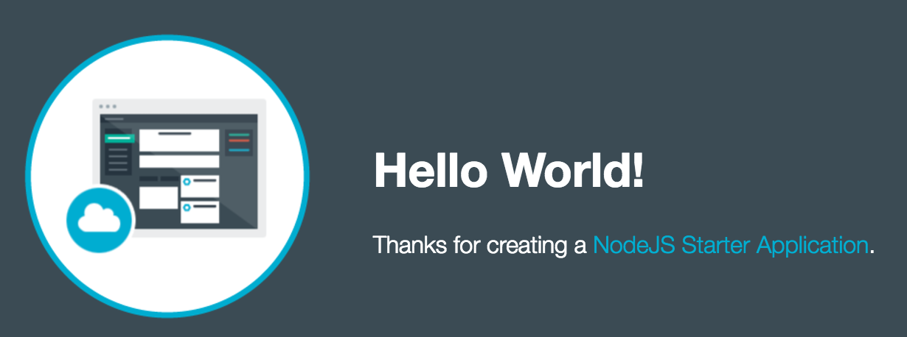
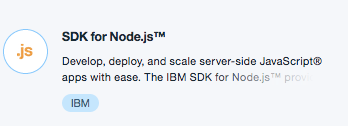
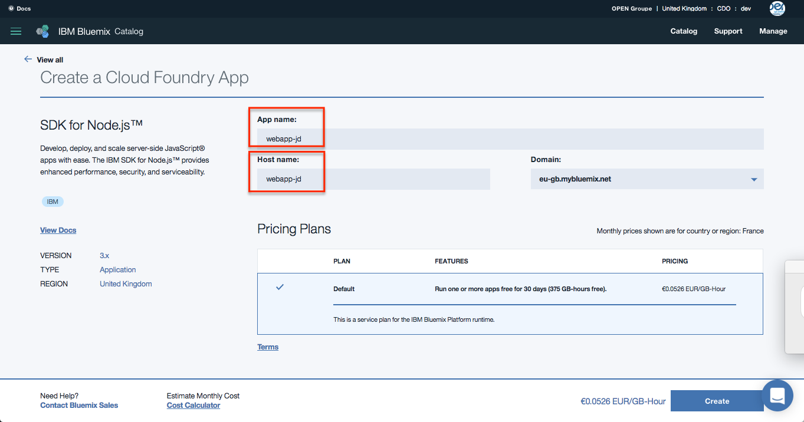
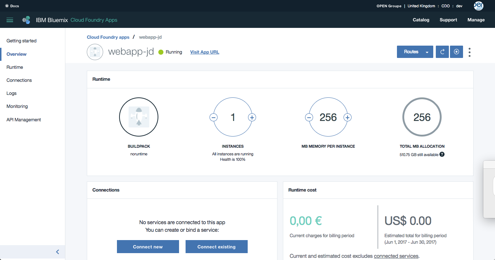
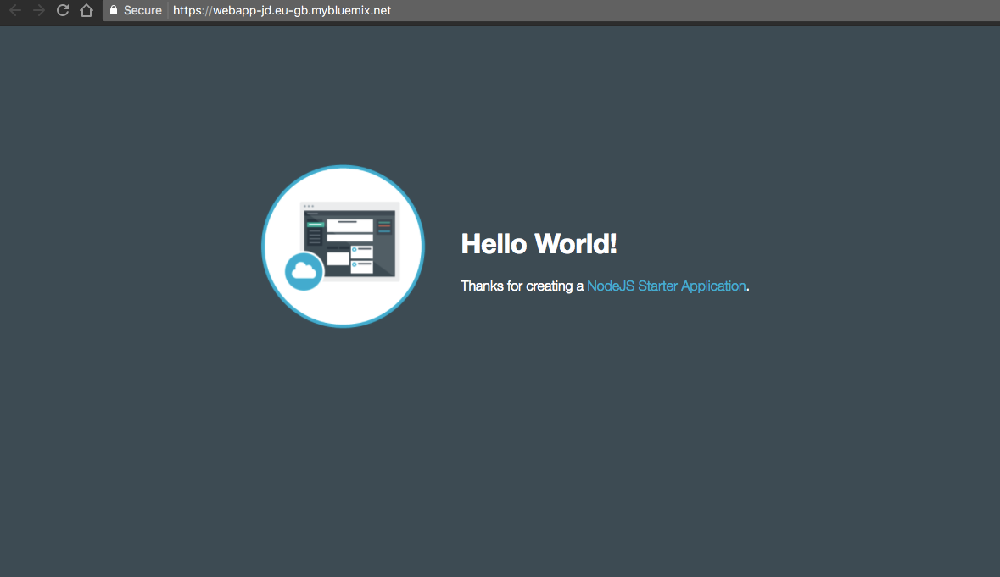
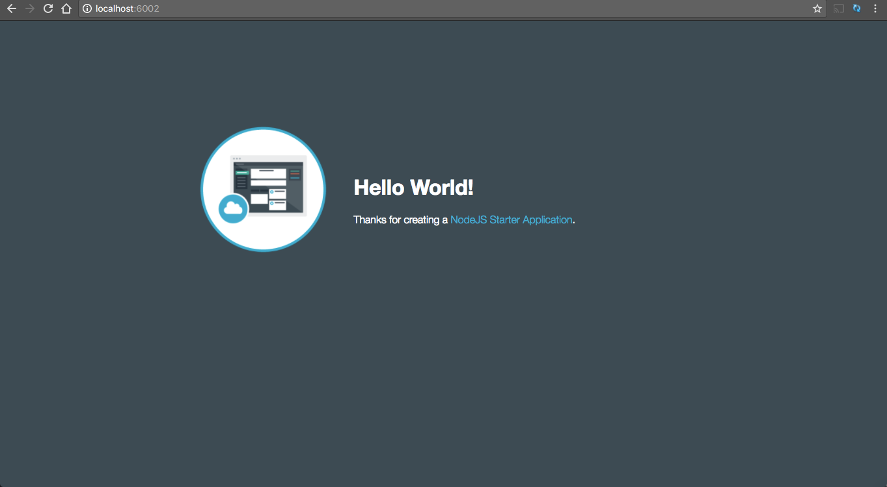
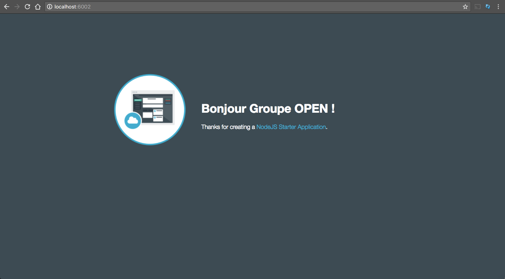
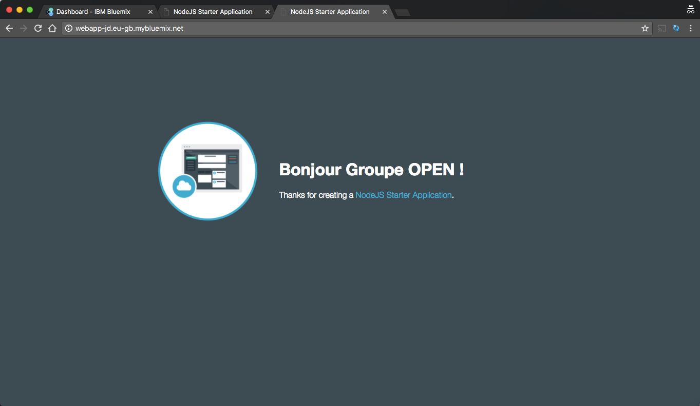

<!-- page_number: true -->
<!-- $size: 16:9 -->
<!-- prerender: true -->
<!-- footer: OPEN GROUPE - Formation Bluemix - JUIN 2017 -->

# Introduction

Dans cet exercice, vous allez découvrir les concepts de développement avec Cloud Foundry et les services Bluemix.
Dans cet exercice, vous allez créer une simple application web.


---

# Objectif

Dans l'exercice suivant, vous allez apprendre à :

+ Déployer une nouvelle application Cloud Foundry  basée sur le runtime Node.js
+ Utiliser la ligne de commande Cloud Foundry

---

# Prérequis

+ Avoir un [Bluemix IBM id](https://bluemix.net), ou  utiliser son compte existant.
+ Installer le [Bluemix CLI](http://clis.ng.bluemix.net)
+ Installer un [Git client](https://git-scm.com/downloads)
+ Installer [Node.js](https://nodejs.org)

---

# Etapes

1. [Créer une nouvelle application web depuis la console](#etape-1---Creer une-nouvelle-application-web-depuis-la-console)
1. [Contôler le code localement](#etape-3---controler-le-code-localement)
1. [Exécuter l'application localement](#etape-4---executer-l'application-localement)
1. [Changer un  fichier localement](#etape-5---changer -un-fichier-localement)
1. [Pousser  votre changement  local sur le cloud](#etape-6---pousser-votre-changement-local-sur-le-cloud)
---

# Etape 1 - Creer une nouvelle application web depuis la console

1. Se connecter à la [Console Bluemix](https://console.bluemix.net).

1. Choisir  la  Région **United Kingdom** pour créer votre application.

1. Aller dans le  **Catalogue** Bluemix.

1. Dans la catégorie **Apps** , Choisir **Cloud Foundry Apps**

1. Créer  une nouvelle application avec le runtime ***SDK for Node.js***.



1. Donner un nom unique à votre application (exemple:webapp-[vos-initials])



1. On visualise facilement aux détails de cette application.



1. Accéder à votre application.

Le runtime SDK for Node.js a créer une simple application web "Hello World!" qui nous servira comme point de départ.



---

# Etape 2 - Déployer une application web depuis la ligne de commande

1. Une fois l'application HelloWorld déployée, on peut récupérer le code source utilisé pour s'en inspirer à partir du menu Getting Started de l'application ou depuis un REPO Git.


# Etape 3 - Controler le code localement

1. Ouvrir un terminal ou une invite de commande afin de cloner le repository git

    ```
    git clone <URL-OF-YOUR-GIT-REPO>
    ```

1. Cette commande crée un répertoire de votre projet localement sur votr disque dur.

---

# Etape 4 - Executer l'application localement

1. Se déplacer sur le répertoire du projet

    ```
    cd webapp-[your-initials]
    ```

1. Installer les dépendances node.js pour ce projet

    ```
    npm install
    ```

1. Démarrer l'application

    ```
    npm start
    ```

    Une fois démarrée, la console doit affichée:

    ```
    > NodejsStarterApp@0.0.1 start /Users/jeromedruais/Documents/OPEN/codes/webapp-jd
    > node app.js

    server starting on http://localhost:[port-number]
    ```

1. Accéder à l'application avec votre navigateur web



---

# Etape 5 - Changer un fichier localement

1. Ouvrir le fichier **public/index.html**, modifier le message d'accueil à la ligne 19

1. Recharger la page web pour confirmer le changement localement




---

# Etape 6 - Pousser votre changement local sur le cloud

Cloud Foundry repose sur le fichier *manifest.yml* pour savoir ce qu'il faut faire quand vous poussez une application sur Bluemix.
Un fichier manifest.yml a été généré par défaut pour votre application. Il ressemble à cela:

  ```yml
  applications:
  - path: .
    memory: 256M
    instances: 1
    domain: eu-gb.mybluemix.net
    name: webapp-[your-initials]
    host: webapp-[your-initials]
    disk_quota: 1024M
  ```
---

  Il définit l'infrastructure de l'application à partir du répertoire courant, qui déploiera avec **256MB** de RAM, avec **une** instance, sous le domaine  **eu-g.mybluemix.net** .
L'application sera nommée **webapp-[your-initials]** et il utilisera **webapp-[your-initials]** comme nom de hote.
Il utilisera **1024MB** de disque comme espace disponible.

1. Spécifier le buildpack a utiliser quand on pousse une application Cloud Foundry app est toujours plus rapide que de 'appuyer sur la détection du buildpack . Modifier le fichier Manifest généré en spécifiant le **buildpack** par la ligne suivante:

    ```yml
    applications:
    - path: .
      memory: 256M
      instances: 1
      domain: eu-gb.mybluemix.net
      buildpack: sdk-for-nodejs
      name: webapp-[your-initials]
      host: webapp-[your-initials]
      disk_quota: 1024M
    ```

1. Se connecter à Bluemix en indiquant le endpoint Bluemix de l'URL avec la région où l'application a été crée.

    ```
    bx api https://api.eu-gb.bluemix.net
    ```

1. S'authentifier à Bluemix

    ```
    bx login
    ```

1. Pousser l'application sur Bluemix

    ```
    bx cf push
    ```

1. Quand la commande est terminée, accéder à l'application s'éxécutant dans le cloud pour confirmer que le changement a été déployé

    ```
    requested state: started
    instances: 1/1
    usage: 256M x 1 instances
    urls: webapp-jd.eu-gb.mybluemix.net
    last uploaded: Tue Jun 6 15:11:45 UTC 2017
    stack: unknown
    buildpack: sdk-for-nodejs

     state     since                    cpu    memory          disk          details
     #0   running   2017-06-06 05:12:28 PM   0.0%   59.7M of 256M   67.7M of 1G
    ```




---

## Enjoy Bluemix ! :+1:
