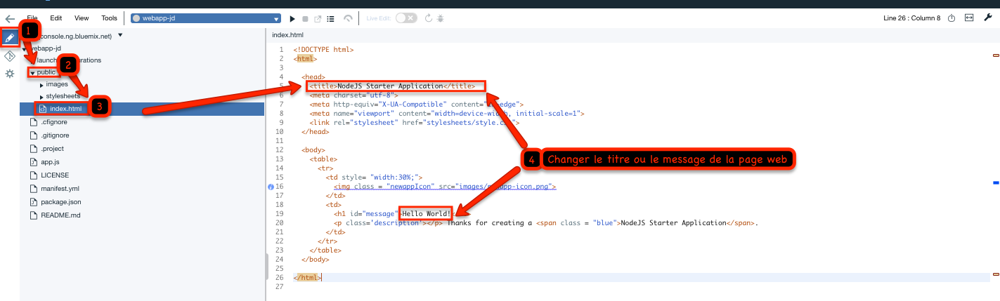

# DevOps avec Bluemix

<!-- page_number: true -->
<!-- $size: 16:9 -->
<!-- prerender: true -->
<!-- footer: OPEN GROUPE - Formation Bluemix - JUIN 2017 -->

Adoptez une approche DevOps en utilisant le Continuous Delivery, qui inclut une chaîne d'outils ouverte automatisant la génération et le déploiement d'applications. Vous pouvez commencer en créant une chaîne d'outils de déploiement simple qui prend en charge les tâches de développement, de déploiement et les opérations.

---
Vous utiliserez l'application Todo avec les outils DevOps de Bluemix.


---
# Objectif

Dans l'exercice suivant, vous allez apprendre à :

+ Mettre en place un dépot pour votre code source afin de collaborer
+ Gérer l'intégration continue et le déploiement continu
---
# Prérequis

+ Avoir un [Bluemix IBM id](https://bluemix.net), ou  utiliser son compte existant.
+ Installer le [Bluemix CLI](http://clis.ng.bluemix.net)
+ Installer un [Git client](https://git-scm.com/downloads)
+ Installer [Node.js](https://nodejs.org)


----

# Etapes


1. [Activer le déploiement continu](#etape-1---activer-le-déploiement-continu)

1. [Soumettre votre changement et le voir se déployer automatiquement](#etape-2---soumettre-votre-changement-et-le-voir-se-déployer-automatiquement)


---


# Etape 1 - Activer le déploiement continu

Maintenant ajoutez un dépot pour votre code source et un pipeline de déploiement automatique à votre projet. Le dépot Git et la gestion des issue tracking est géré:
  + soit par IBM et fonctionne avec GitLab Community Edition en mode privé.
  
---
  + soit par GitHub.com en mode public et/ou privé avec un abonnement.
  

---

1. Depuis la page **Overview** de votre application, recherchez **Continuous Delivery** et cliquez sur le bouton **Enable**.

1. Une nouvelle fenêtre s'ouvre pour configurer la chaine d'outil, Toolchain.
La Toolchain contient un dépot Git, un Pipeline de déploiement et un IDE web.

---


---
1. La toolchain propose un nom par défaut qui est modifiable. Dans **Configurable Integrations** en bas, selectionner **Git Repos et Issue Tracking**.

1. Garder les options par défaut **Clone** pour cloner le code source de l'application
 "Hello World!" dans votre compte GitLab ou GitHub.
 ---
 

---
1. La toolchain a été configuré avec succès. Un nouveau dépot Git a été créé, ainsi qu'un Pipeline qui pourra déployer votre application automatiquement à chaque commit.
---


---

1. Ouvrez le dépot Git et notez son URL.

1. Ouvrir un terminal ou une invite de commande afin de cloner le repository git

    ```
    git clone <URL-OF-YOUR-GIT-REPO>
    ```

1. Il se peut que vous ayez une erreur lors de la commande git clone dû à un problème d'autentification.

  ```
git clone https://jerome.druais@git.ng.bluemix.net/jerome.druais/jd-netcore.git
Cloning into 'jd-netcore'...
remote: HTTP Basic: Access denied
remote: You must use a personal access token with 'api' scope for Git over HTTP.
remote: You can generate one at https://git.ng.bluemix.net/profile/personal_access_tokens
fatal: Authentication failed for 'https://jerome.druais@git.ng.bluemix.net/jerome.druais/jd-netcore.git/'

  ```

  Lors de la création du dépot Git dans la Toolchain, la case dépot privé a été cochée.

  

1. Pour résoudre ce blocage, soit :
  1. Rendre le dépot public dans les paramètres de GitLab.
  

  1. Créer un personal access token pour s'authentifier.

    

    

    

1. Relancer la commande git clone avec le token

```
git clone https://jerome.druais:<MON_TOKEN>-s@git.ng.bluemix.net/jerome.druais/jd-netcore.git
Cloning into 'jd-netcore'...
remote: Counting objects: 43, done.
remote: Compressing objects: 100% (36/36), done.
remote: Total 43 (delta 4), reused 0 (delta 0)
Unpacking objects: 100% (43/43), done.
```
1. Cette commande crée un répertoire de votre projet localement sur votr disque dur.


Dans le chapitre précédent, vous poussiez le changement manuellement. Ici, vous bénéficierez des fonctionnalités du dépot Git et du pipeline de déploiement automatique.

---
# Etape 2 - Soumettre votre changement et le voir se déployer automatiquement


1. Depuis la console Bluemix, aller dans l'onglet **Overview** de votre application.

1. Cliquer sur le bouton **View Toolchain** dans la section Continuous Delivery.
---
1. Cliquer sur ORION, la Web IDE

---
1. Une nouvelle fenêtre s'ouvre, vous permettant d'accèder en édition à votre code source.

---
1. Ouvrir le fichier **public/index.html**.

1. Changer le titre de la page à la ligne 5.

1. Sauvegarder le changement.
---
1. Soumettre le changement via l'icône Git.

---
1. Revenir sur **Delivery Pipeline**.

1. Regarder la prise en compte de votre changement par le Delivery pipeline  qui rédéploie l'application.

---

1. Quand la commande est terminée, accéder à l'application s'éxécutant dans le cloud pour confirmer que le changement a été déployé.

---


1. Il est maintenant nécessaire de copier le code source de l'application Todo vers ce nouveau répertoire local créé par la commande git clone.

1. Ajouter les nouveaux fichiers à Git.
    ```
    git add .
    ```

1. Soumettre le changement.
    ```
    git commit -a -m "full solution"
    ```

    Note: Vous devrez peut-etre configurer pour la premierè fois:
    ```
    git config --global user.email "you@example.com"
    git config --global user.name "Your Name"
    ```

1. Pousser votre changement.

    ```
    git push
    ```
---

1. Revenir sur **Delivery Pipeline**.

1. Regarder la prise en compte de votre changement par le Delivery pipeline  qui rédéploie l'application.
    
---

1. Quand la commande est terminée, accéder à l'application s'éxécutant dans le cloud pour confirmer que le changement a été déployé.
    
---
Suivre le chapitre suivant [Les containers avec Bluemix](../containers).

---
## Enjoy Bluemix ! :+1:
