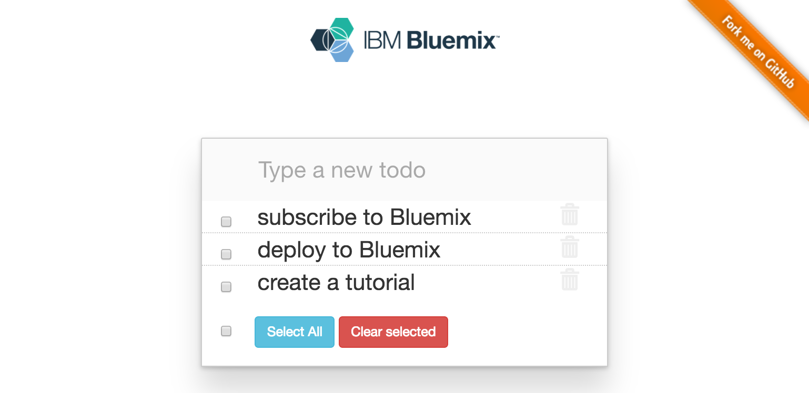
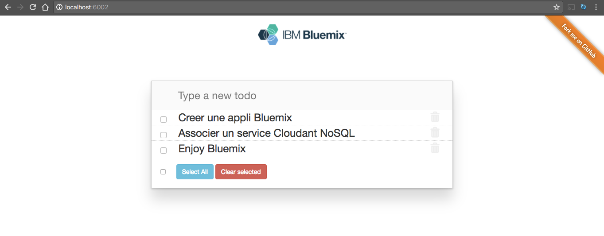
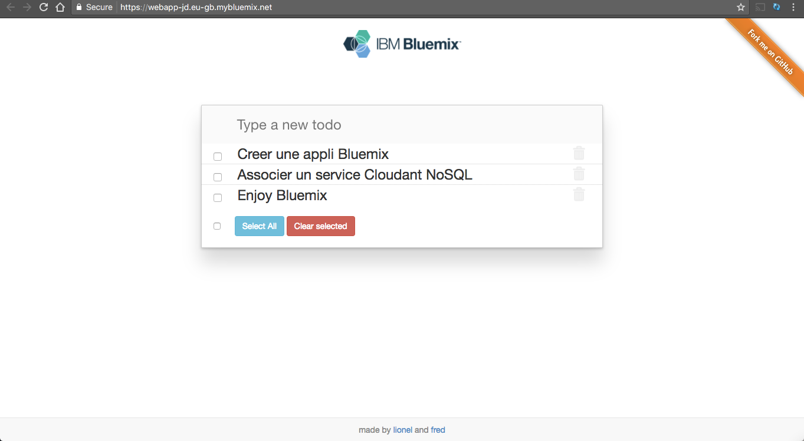

  # Enrichir votre application Bluemix avec les services

  <!-- page_number: true -->
  <!-- $size: 16:9 -->
  <!-- prerender: true -->
  <!-- footer: OPEN GROUPE - Formation Bluemix - JUIN 2017 -->


  # Introduction

  Dans ce chapitre, vous allez enrichir votre application nouvellement crééé avec des services additionnels provenant du catalogue Bluemix.
  A trevers cet exercice, vous allez créer une application basée sur le stack CLEAN (CLoudant NoSQL database, Express, Angular et Node.js).

  
  ---

  # Objectif

  Dans l'exercice suivant, vous allez apprendre à :

  + Déployer une nouvelle application Cloud Foundry  basée sur le runtime Node.js
  + Créer un nouveau service de base de données Cloudnant pour stocker vos données NoSQL
  + Utiliser la ligne de commande Cloud Foundry

  ---

  # Prérequis

  + Avoir un [Bluemix IBM id](https://bluemix.net), ou  utiliser son compte existant.
  + Installer le [Bluemix CLI](http://clis.ng.bluemix.net)
  + Installer un [Git client](https://git-scm.com/downloads)
  + Installer [Node.js](https://nodejs.org)

  ---

  # Etapes


  1. [Récupérer le code source de l'application Todo](#etape-1---récupérer-le-code-source-de-lapplication-todo)
  1. [Créer et associer le service Cloudant](#etape-2---créer-et-associer-le-service-cloudant)
  1. [Connecter la DB Cloudant avec le code de l'application](#etape-3---connecter-la-db-cloudant-avec-le-code-de-lapplication)
  1. [Exécuter l'application Todo localement](#etape-4---exécuter-lapplication-todo-localement)
  1. [Pousser  votre code local sur le cloud](#etape-5---pousser--votre-code-local-sur-le-cloud)
  ---

  # Etape 1 - Récupérer le code source de l'application Todo

  Dans le chapitre précédent, nous avons vu les bases pour modifier et déployer une application.
  Concentrons nous maintenant pour concevoir une application de Todo liste. L'applicationa déjà été développé et est disponible dans ce dépot Git.

  Votre premiere tache consiste à intégrer ce code dans l'application que vous venez de créer, en remplaçant le code existant.

  1. Supprimer tous les fichiers et dossiers de votre application  all files and folders from your app **sauf le fichier manifest.yml et le dossier .git**.

  1. Télécharger l'application complete Todo  depuis [cette archive](./solution/node-todo-master.zip) dans un répertoire temporaire.

  1. Extraire les fichiers  dans un  répertoire temporaire.. Cela va créer un dossier  *node-todo-master*.

  1. Copier tous ces fichiers et dossiers vers le dossier de  votre application.

  Note: Assurez vous que les fichiers cachés (.gitignore, .cfignore et .bowerrc) seront aussi copiés.


  # Etape 2 - Créer et associer le service Cloudant

  Afin d'enregistrer nos todos, nous aurons besoin d'un stockage persistant. Pour cela, nous allons utiliser une base de données Cloudant NoSQL, base de données documents, compatible avec CouchDB.

  1. Revenir à la console Bluemix, allez sur le menu **Overview** de votre application.

  1. Cliquer sur **Connect New** pour ajouter un service à votre application.

  1. Rechercher **Cloudant** dans le catalogue

  1. Choisir le plan gratuit **Lite**

  1. Donner un nom à votre service comme **todo-cloudant-[your-initials]**

  1. Cliquer sur **Create**. Bluemix va ainsi provisionner une base de données Cloudant et la connecter à votre application.

  1. Choisir **Restage** quand on vous le demande.

      Votre application va redemarrée et les informations de connexion du service seront disponible dans votre application.

      Note: Toutes ces étapes sont réalisables en ligne de commande:

      ```
      cf create-service cloudantNoSQLDB Lite todo-cloudant-[your-initials]
      cf bind-service todo-[your-initials] todo-cloudant-[your-initials]
      cf restage todo-[your-initials]
      ```

  # Etape 3 - Connecter la DB Cloudant avec le code de l'application

  Quand votre application s'éxécute sur Cloud Foundry, toutes les informations des services associés à votre application sont disponible dans la variable d'environnement **VCAP_SERVICES**.

  Afin de tester cette approche, nous allons créer un fichier local d'environnement  (JSON), et valider si les valeurs sont bien chargées avec notre application déployée localement.

  1. Dans la console Bluemix, aller sur le dashboardde votre dashboard.

  1. Choisir **Runtime**, et **Environment Variables**

  1. Copier tout le contenu de **VCAP_SERVICES** dans le fichier local vcap-local.json de votre projet. S'assurer de copier le contenu en dessous de l'élément services. Cela doit ressembler à ça:

      ```json
      {
        "services":
        {
          "cloudantNoSQLDB": [
            {
              "credentials": {
                  "username": "XXXX",
                  "password": "XXXX",
                  "host": "XXXXXX-bluemix.cloudant.com",
                  "port": 443,
                  "url": "https://....-bluemix.cloudant.com"
              },
              "name": "todo-cloudant",
              "label": "cloudantNoSQLDB",
              "plan": "Lite",
              ...
            }
          ]
        }
      }
      ```


  # Etape 4 - Exécuter l'application Todo localement

  1. Installer les dépendances node.js

      ```
      npm install
      ```

  1. Démarrer l'application

      ```
      npm start
      ```

  1. Accéder à l'application avec votre navigateur web

  


  # Etape 5 - Pousser  votre code local sur le cloud

  1. Se connecter à Bluemix en indiquant le endpoint Bluemix de l'URL avec la région où l'application a été crée.

      ```
      bx api https://api.eu-gb.bluemix.net
      ```

  1. S'authentifier à Bluemix

      ```
      bx login
      ```

  1. Pousser l'application sur Bluemix

      ```
      bx cf push
      ```

  1. Quand la commande est terminée, accéder à l'application s'éxécutant dans le cloud pour confirmer que le changement a été déployé


  ```
  requested state: started
  instances: 1/1
  usage: 256M x 1 instances
  urls: webapp-jd.eu-gb.mybluemix.net
  last uploaded: Wed Jun 7 14:46:39 UTC 2017
  stack: unknown
  buildpack: sdk-for-nodejs

       state     since                    cpu    memory      disk      details
  #0   running   2017-06-07 04:47:58 PM   0.0%   0 of 256M   0 of 1G
  ```

  


  Félicitations ! Vous avez complété cet exercice.
  Vous pouvez prendre connaissance du code source de l'application.

  ## Source code

  ### Back-end

  | File | Description |
  | ---- | ----------- |
  |**package.json**|Lists the node.js dependencies|
  |**.cfignore**|List of files and directories ignored when calling **cf push**. Typically we ignore everything that can be retrieved with bower or npm. This speeds up the push process.|
  |**manifest.yml**|Used by Cloud Foundry when pushing the application to define the application environment, connected services, number of instances, etc.|
  |**app.js**|Web app backend entry point. It initializes the environment and imports the Todo API endpoints|
  |**todos.js**|Todo API implementation. It declares endpoints for PUT/GET/DELETE (create/retrieve/delete) and handles the *in-memory* storage.

  ### Front-end

  | File | Description |
  | ---- | ----------- |
  |**.bowerrc**|Configuration file for the [bower](http://bower.io/) web package manager to put our web dependencies under public/vendor|
  |**bower.json**|Web dependencies (bootstrap, angular)|
  |**index.html**|Web front-end implementation. It displays the todo list and has a form to submit new todos.|
  |**todo.js**|Declares the Angular app|
  |**todo.service.js**|Implements the connection between the front-end and the back-end. It has methods to create/retrieve/delete Todos|
  |**todo.controller.js**|Controls the main view, loading the current todos and adding/removing todos by delegating to the Todo service|


  # Resources

  For additional resources pay close attention to the following:

  - [GitHub Guides](https://guides.github.com/)
  - [Get started guides for your favorite runtimes](https://www.ibm.com/blogs/bluemix/2017/03/runtimes-get-started-guides/?social_post=829410659&fst=Learn&linkId=35308736)

---
Suivre le chapitre suivant [DevOps avec Bluemix](devops/README.md).
---


  ## Enjoy Bluemix ! :+1:
