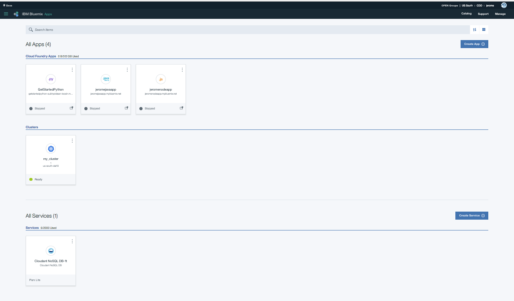

# Tour de l'interface graphique de Bluemix

Regarder cette vidéo pour faire un tour de son interface graphique
<center>
      <a href="https://youtu.be/gq5MvY1nNOM"></a>
   </center>

>

## 1. Se connecter à Bluemix

Il suffit de se rendre sur l'url [www.bluemix.net](http://www.bluemix.net) et de rentrer ses identifiants de connexion.

<center>
      
</center>


```
   Rentrer son compte utilisateur.
   ```
   
<center>
      
</center>


```
   Rentrer son mot de passe.
   ```
<center>
      
</center>

```
   Voila, vous etes connecté.
   ```
   
   <center>
      
</center>

## 2. Compte/Region/Organisation/espace.

```
   Chaque utilisateur peut avoir accès à des régions, des organisations, des espaces suivant les autorisations qu'il a reçu.
    ```
> Attention, seul le responsable du compte Bluemix d'OPEN groupe (account owner) est autoriser à créer des organisations.
 


## 1. .....

....

1. *****

   ```
   ******
   ```

   > *****.
