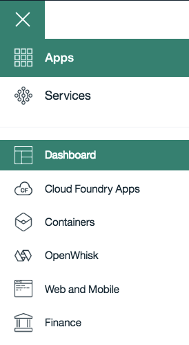
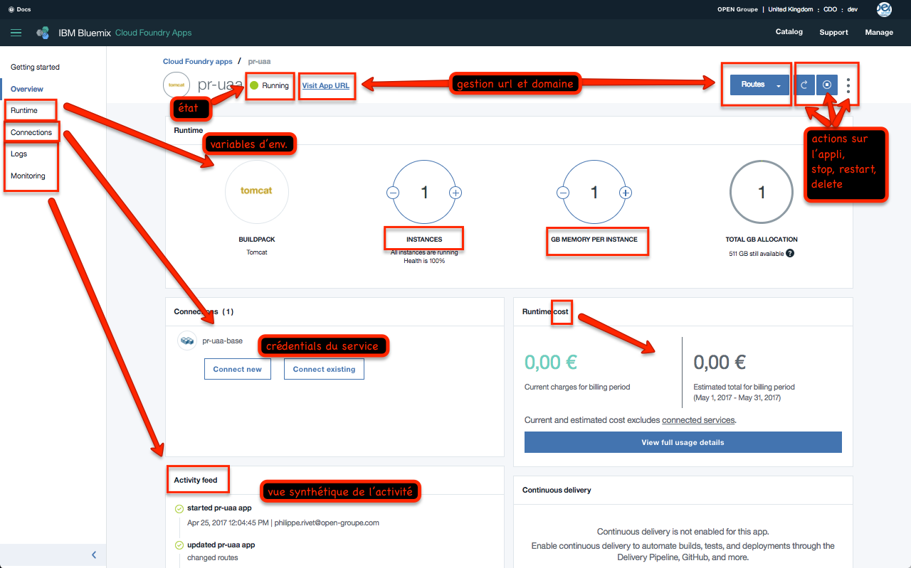
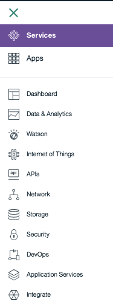
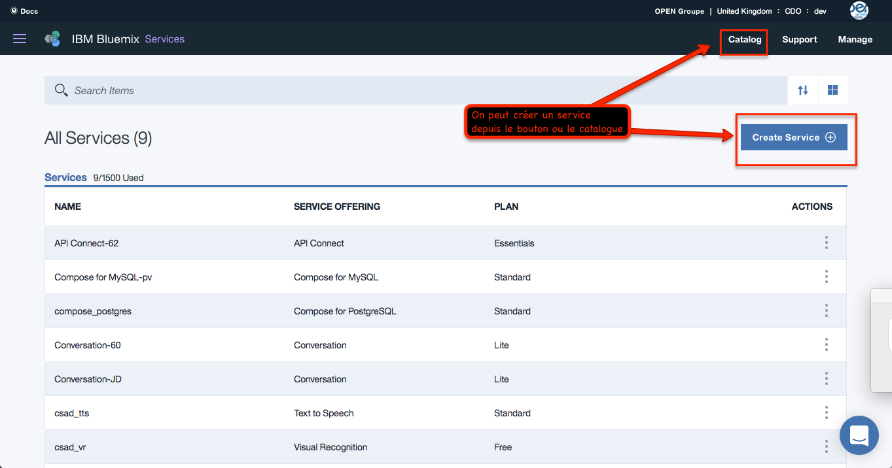
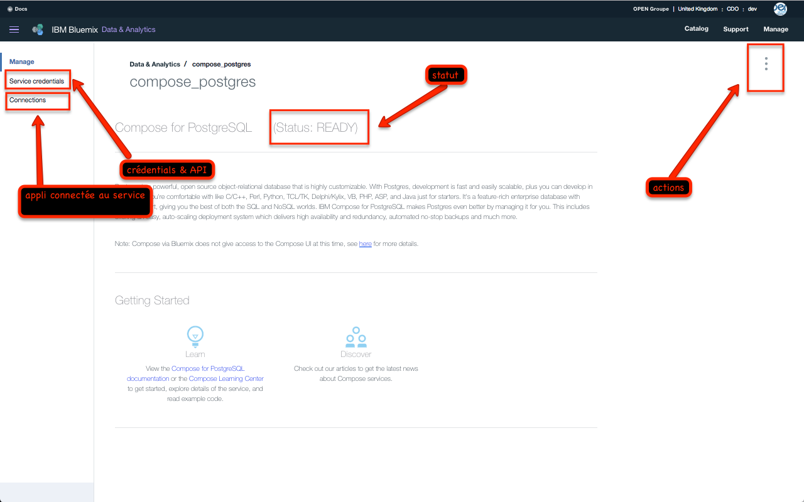

# Tour de l'interface graphique de Bluemix

Regarder cette vidéo pour faire un tour de son interface graphique
<center>
      <a href="https://youtu.be/gq5MvY1nNOM"></a>
   </center>


## 1. Se connecter à Bluemix

Il suffit de se rendre sur l'url [www.bluemix.net](http://www.bluemix.net) et de rentrer ses identifiants de connexion.

<center>
      
</center>


```
Rentrer son compte utilisateur.
```

<center>
      
</center>


```
Rentrer son mot de passe.
```
<center>
      
</center>

```
Voila, vous etes connecté.
```

<center>
      
</center>

## 2. Compte/Region/Organisation/espace.

```
Chaque utilisateur peut avoir accès à différentes régions, différentes organisations ou différents espaces suivant les autorisations qu'il a reçu.
Il peut ainsi déployer des applications, des conteneurs ou des services.
```


<center>
      
</center>


1. Regions.

Une région correspond à un térritoire géographique (Datacenter) où l'on peut déployer des applications et utiliser des services.

<center>
      
</center>

```
L'offre Public de Bluemix propose 4 régions différentes à ce jour.
```

Si on utilise l'interface utilisateur (**GUI**), on peut passer d'une région à une autre.Pour cela, cliquer sur le lien du compte utilisateur, étendre le choix **Region** et choisir la région parmi la liste donnée.

<center>
      
</center>

Si on utilise l'interface en ligne de commande (**CLI**), il faut utilise la commande cf api et indiquer le **endpoint API** de la région souhaitée.
Par exemple, la commande suivante permet de se connecter à la région d'Europe du Royaume Uni.

```
cf api https://api.eu-gb.bluemix.net
```
>Ci dessous, le tableau classe les 4 régions disponibles.

| **Region name** | **Geographic location** | **Region prefix** | **cf API endpoint** | **UI console** |
|-----------------|-------------------------|-------------------|---------------------|----------------|
| US South region | Dallas, US | ng | api.ng.bluemix.net | console.ng.bluemix.net |
| United Kingdom region | London, England | eu-gb | api.eu-gb.bluemix.net | console.eu-gb.bluemix.net |
| Sydney region | Sydney, Australia | au-syd | api.au-syd.bluemix.net | console.au-syd.bluemix.net |
| Germany region | Frankfurt, Germany | eu-de | api.eu-de.bluemix.net | console.eu-de.bluemix.net |


2. Organisations.

Le responsable du compte Bluemix créer les organisations.
exemple : Moodpeek, Gamo, ...
Il créer les utilisateurs qui peuvent avoir le droit de gérer une ou plusieurs organisations.
Le manager de l'organisation peut créer autant d'espace qu'il le souhaite.
exmple : Prod, Preprod, Dev, ...


> Attention, seul le responsable du compte Bluemix d'OPEN groupe (account owner) est autoriser à créer des organisations.


3. Espaces.


Pour créer un espace, cliquer sur le nom de votre compte Bluemix en haut à droite et cliquer sur **create a space**.

> Attention, seul le responsable d'une organisation (org manager) est autoriser à créer des espaces.


<center>
      
</center>


## 3. Applications

Le menu (en haut à gauche) permet de naviguer entre vos applications ou vos services.
<center>
      
</center>

Une fois le menu ouvert, voici les actions possibles.
<center>
      
</center>

On peut ici controler ses applications depuis son tableau de bord.

<center>
      
</center>

En cliquant sur une application depuis le tableau de bord, on a accès à plus d'informations pour la gérer finement (Nombres di'nstance, RAM, url, Logs, services associés,...)

<center>
      
</center>


## 4. Services

A partir du menu (en haut à gauche), on navigue vers les services.
<center>
      
</center>

Une fois le menu ouvert, voici les actions possibles.
<center>
      
</center>

On peut ici controler ses services depuis son tableau de bord ou par thèmes.

<center>
      
</center>

En cliquant sur un service depuis le tableau de bord, on a accès à plus d'informations pour le gérer (Credentials, services associés,...)

<center>
      
</center>


....

1.


```
   ******.
   ```

   > .
