# Tour de l'interface graphique de Bluemix

<!-- page_number: true -->
<!-- $size: 16:9 -->
<!-- prerender: true -->
<!-- footer: OPEN GROUPE - Formation Bluemix - JUIN 2017 -->

Regarder cette vidéo pour faire un tour de son interface graphique

[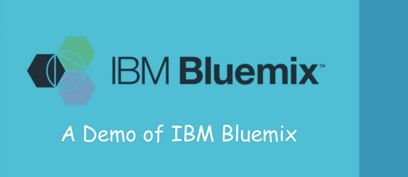](https://youtu.be/gq5MvY1nNOM)


---

## 1. Se connecter à Bluemix

Il suffit de se rendre sur l'url [www.bluemix.net](http://www.bluemix.net) et de rentrer ses identifiants de connexion.

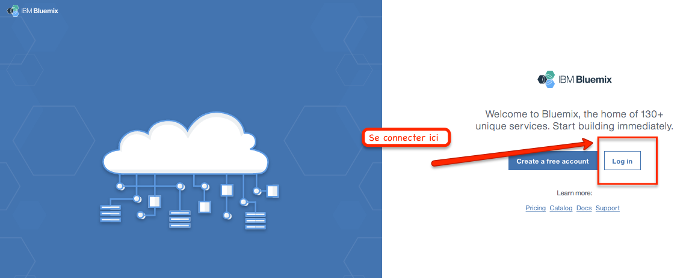

---

```
Rentrer son compte utilisateur.
```

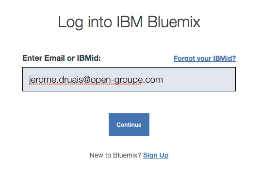


---

```
Rentrer son mot de passe.
```
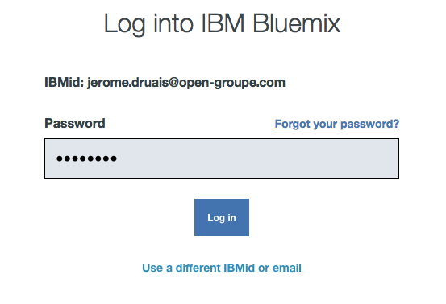


---

```
Voila, vous etes connecté.
Vous allez ainsi pouvoir créer des applications web ou mobiles innovantes.
Vous allez tirer profit des services variés disponible dans le catalogue.
Mêler les technologies IaaS et PaaS, 
allant de la machine virtuelle au containeur Docker.

```
---
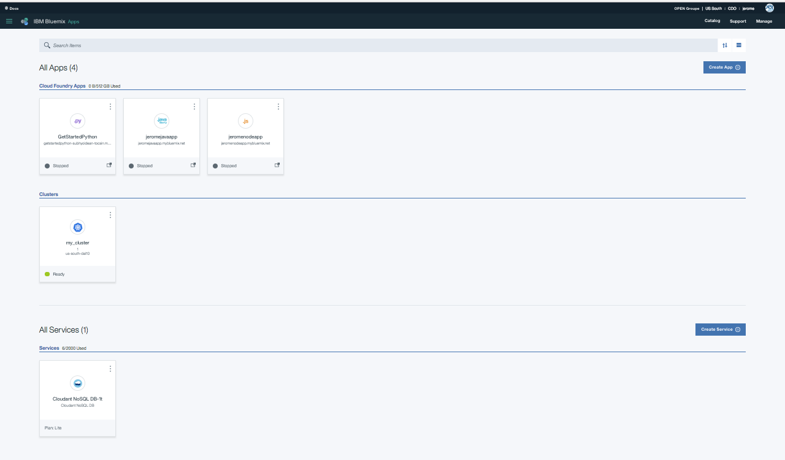


---

## 2. Compte/Region/Organisation/espace.

```
Chaque utilisateur peut avoir accès à différentes régions,
différentes organisations ou différents espaces
suivant les autorisations qu'il a reçu.
Il peut ainsi déployer des applications, des conteneurs ou des services.
```


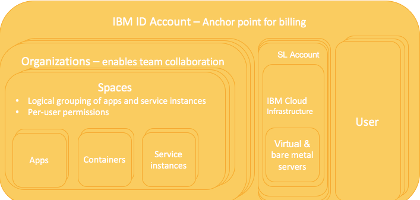


---


1. Regions.

Une région correspond à un térritoire géographique (Datacenter) où l'on peut déployer des applications et utiliser des services.

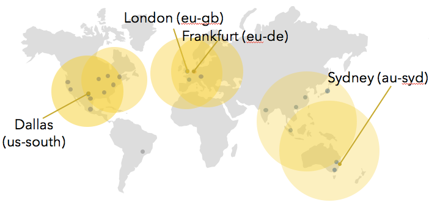

---

```
L'offre Public de Bluemix propose 4 régions différentes à ce jour.
```

Si on utilise l'interface utilisateur (**GUI**), on peut passer d'une région à une autre.Pour cela, cliquer sur le lien du compte utilisateur, étendre le choix **Region** et choisir la région parmi la liste donnée.

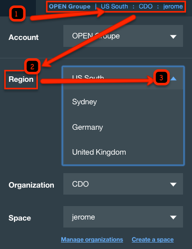

---

Si on utilise l'interface en ligne de commande (**CLI**), il faut utilise la commande cf api et indiquer le **endpoint API** de la région souhaitée.
Par exemple, la commande suivante permet de se connecter à la région d'Europe du Royaume Uni.

```
cf api https://api.eu-gb.bluemix.net
```
---

>Ci dessous, le tableau classe les 4 régions disponibles.

| **Region name** | **Geographic location** | **Region prefix** | **cf API endpoint** | **UI console** |
|-----------------|-------------------------|-------------------|---------------------|----------------|
| US South region | Dallas, US | ng | api.ng.bluemix.net | console.ng.bluemix.net |
| United Kingdom region | London, England | eu-gb | api.eu-gb.bluemix.net | console.eu-gb.bluemix.net |
| Sydney region | Sydney, Australia | au-syd | api.au-syd.bluemix.net | console.au-syd.bluemix.net |
| Germany region | Frankfurt, Germany | eu-de | api.eu-de.bluemix.net | console.eu-de.bluemix.net |

---


2. Organisations.

Le responsable du compte Bluemix créer les organisations.
exemple : Moodpeek, Gamo, ...
Il créer les utilisateurs qui peuvent avoir le droit de gérer une ou plusieurs organisations.
Le manager de l'organisation peut créer autant d'espace qu'il le souhaite.
exmple : Prod, Preprod, Dev, ...


> Attention, seul le responsable du compte Bluemix d'OPEN groupe (account owner) est autoriser à créer des organisations.
---

3. Espaces.


Pour créer un espace, cliquer sur le nom de votre compte Bluemix en haut à droite et cliquer sur **create a space**.

> Attention, seul le responsable d'une organisation (org manager) est autoriser à créer des espaces.

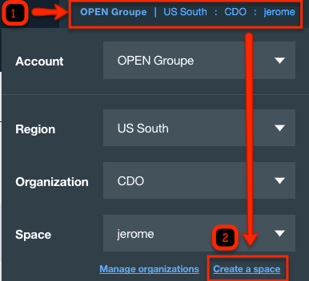

---

## 3. Options de son compte
Le menu en haut à droite permet d'accéder à la gestion de son compte (**Manage**), à la gestion du support (**Support**) et au catalgue de services (**Catalog**).

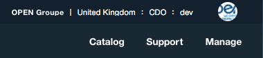

---

#### 3.1 Cliquer sur **Manage**>**Account** pour afficher les options de son compte.

3 sous-menus sont disponibles.

* Users.
* Organizations.
* Notifications.

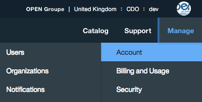

---

**Users** - Permet de gérer les utilisateurs et les clés API
>Identity & Access

>Bluemix API keys


**Organizations** - Permet de gérer ses Organisations et ses espaces.(autorisations des users, gestion des domaines, gestion des quotas)

>Profile

>Notifications

>Usage Dashboard

>Manage Organizations

**Notifications** - Permet de parametrer les notifications par mail relatives à la plate-forme Bluemix
>Incidents

>Maintenances planifiées

---

#### 3.2 Cliquer sur **Manage**>**Billing and Usage** pour afficher les options de facturation.


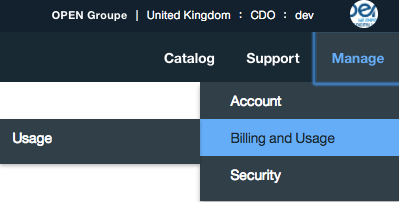


**Usage** - Permet d'afficher sa consommation Bluemix - Uniquement avec l'option Billing Manager activée

>Usage Dashboard

---


#### 3.3 Cliquer sur **Manage**>**Security** pour afficher les options de sécurité.

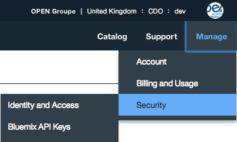

**Identity and Access** - Permet de gérer les comptes utilisateurs et les clés API.

>Identity and Access

>Bluemix API keys

---

## 4. Support


### 4.1 Cliquer sur **Support** pour accéder aux options de support.
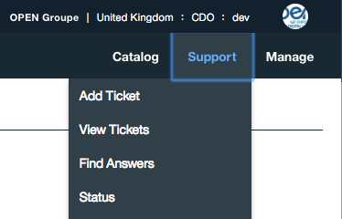

---

**Add Ticket** - Permet de créer un ticket au support Bluemix

>Add Ticket

**View Ticket** - Permet d'afficher ses tickets Bluemix

>View Ticket

**Find Answers** - Permet d'accèder aux ressources documentaires Bluemix (documentation Bluemix et forum StackOverflow)

>Find Answers

**Status** - Permet de connaitre le statut actuel de la plate-forme et des services
>Status

---

## 5. Cliquer sur **Catalog** pour accéder aux services disponibles dans le catalogue.

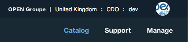

La force de Bluemix se situe au niveau de son catalogue de services riche de plus de 140 services classés par famille.

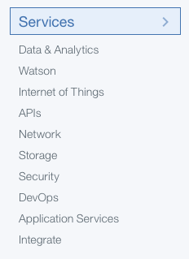


Le [chapitre 2](../catalog) parle en détail du catalogue de services.

---

## 6. Le Menu
Le menu (en haut à gauche) permet de naviguer entre vos applications ou vos services.


Une fois le menu ouvert, voici les actions possibles.
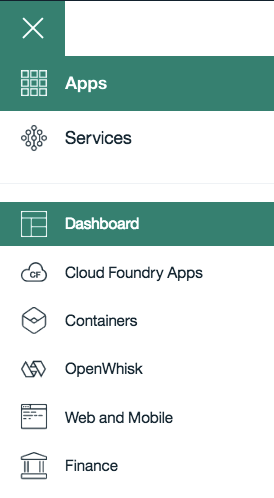

---

##### 6.1 Applications
On peut ici contrôler ses applications depuis son tableau de bord.
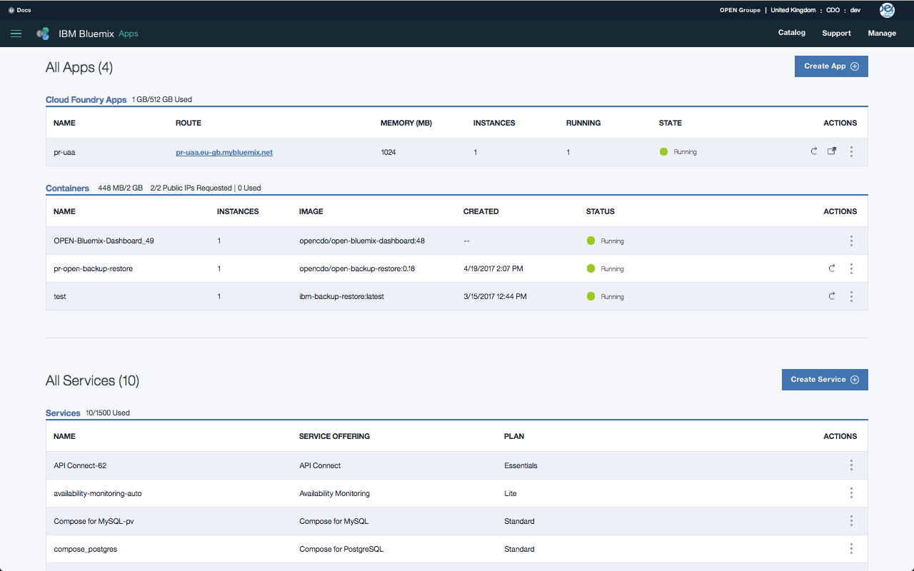
Le [chapitre 3](../deploy) parle en détail des applications.

---
##### 6.2. Services
A partir du menu (en haut à gauche), on navigue vers les services.


Une fois le menu ouvert, voici les actions possibles.
On peut ici controler ses services depuis son tableau de bord ou par thèmes.

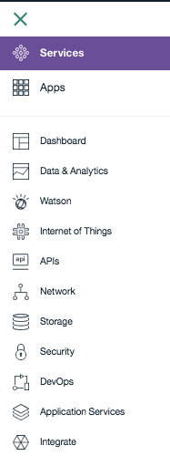

---

En cliquant sur un service depuis le tableau de bord, on a accès à plus d'informations pour le gérer (Credentials, applications associées,...)
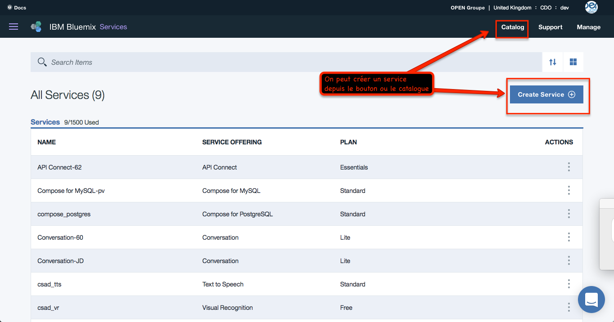

Le [chapitre 2](catalog/README.md) parle en détail des applications.

---

## 7. La documentation
En cliquant en haut à gauche sur le lien [docs](https://console.ng.bluemix.net/docs/), on accède à la documentation en ligne de Bluemix
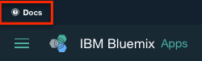

---
Il est possible de chercher via le moteur de recherches ou par thèmes.
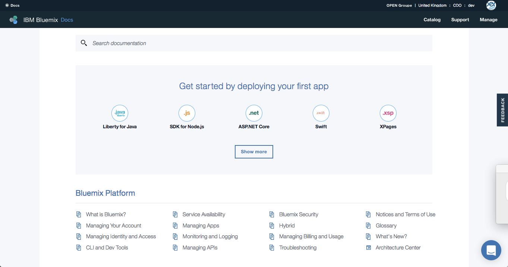

---
Suivre le chapitre suivant [Le catalogue Bluemix](../catalog).

---

## Enjoy Bluemix ! :+1:
